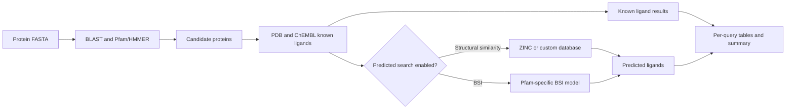

# LigQ 2

LigQ 2 is a protein-to-ligand discovery platform. Given one or more protein
sequences in FASTA format, it identifies related proteins with ligand evidence,
collects their experimentally supported ligands from PDB and ChEMBL, and can
expand those results with compounds from ZINC or a user-provided database.

LigQ 2 combines:

- BLAST sequence similarity;
- Pfam domain detection with HMMER;
- curated protein-ligand associations from PDB and ChEMBL;
- molecular similarity with RDKit fingerprints or learned embeddings;
- the optional Bioactivity Similarity Index (BSI) for supported protein
  families;
- an interactive web interface and a technical command-line interface.

> [!IMPORTANT]
> LigQ 2 prioritizes candidate ligands computationally. Its results are intended
> for research use and should be validated experimentally before biological or
> therapeutic conclusions are drawn.

## Contents

- [How LigQ 2 works](#how-ligq-2-works)
- [Choose how to run LigQ 2](#choose-how-to-run-ligq-2)
- [Docker and web interface: recommended](#docker-and-web-interface-recommended)
- [Using the web interface](#using-the-web-interface)
- [Native installation and command-line usage](#native-installation-and-command-line-usage)
- [Candidate protein search modes](#candidate-protein-search-modes)
- [Predicted ligand search](#predicted-ligand-search)
- [BSI search](#bsi-search)
- [Input and output files](#input-and-output-files)
- [Custom compound databases](#custom-compound-databases)
- [Additional molecular representations](#additional-molecular-representations)
- [Database updates](#database-updates)
- [Cache behavior](#cache-behavior)
- [Data layout](#data-layout)
- [Performance and GPU usage](#performance-and-gpu-usage)
- [Troubleshooting](#troubleshooting)
- [Data sources](#data-sources)

## How LigQ 2 works



For each query sequence, the pipeline:

1. detects strict sequence matches, domain-compatible nearest neighbors, and/or
   shared-domain candidates;
2. ranks candidate proteins using BLAST and Pfam/HMMER evidence;
3. retrieves curated ligands associated with those proteins;
4. optionally searches a compound provider using Tanimoto, Cosine similarity,
   or BSI;
5. removes repeated ligands per query by default and preserves the evidence from
   the highest-ranked contributing protein;
6. writes detailed per-query tables and a global summary.

The final protein ranking contains only proteins that contribute at least one
retained known or predicted ligand after per-query deduplication.

## Choose how to run LigQ 2

| Mode | Recommended for | Interface | GPU |
| --- | --- | --- | --- |
| Docker Compose | Most users; Windows, Linux, and macOS | Web interface and containerized CLI | No, current images are CPU-only |
| Native Conda | Technical users, automation, large searches | Command line | Yes, NVIDIA CUDA |
| Native frontend/backend | GUI development | Web development servers | Uses the native pipeline environment |

Docker is the easiest way to run the complete application. The native Conda
workflow exposes every pipeline option and is the recommended route for GPU
execution.

> **Docker (CPU) or native installation:** the published Docker images are
> compatible with CPU-only systems and cover the standard LigQ 2 workflow. For
> advanced options that require CUDA, such as BSI or generating and using
> ChemBERTa embeddings, install the native Conda environment. The native
> installation is also recommended for large workloads that need greater
> computing capacity.

## Docker and web interface: recommended

### Requirements

- Docker Engine with Docker Compose v2 on Linux, or Docker Desktop on Windows
  or macOS;
- Internet access for the container images and first-time data download;
- enough free disk space for the images, databases, results, and temporary
  files.

The setup screen calculates the current missing download size from the official
Hugging Face dataset and compares it with available space before installation.
The current GUI-ready dataset is approximately 6.95 GB (6.47 GiB), but the live
Hugging Face metadata is the source of truth. Database updates and large result
histories may require substantially more space.

The published images target `linux/amd64`. Docker Desktop can run them on other
host architectures through emulation, with a possible performance cost.

> **ChemBERTa and Docker:** the current Docker images are CPU-only. The web
> interface therefore disables generation of Hugging Face/ChemBERTa
> representations. Generating ChemBERTa embeddings on CPU is **strongly
> discouraged**: every compound in both the selected provider and the compatible
> `pdb_chembl` reference must be processed, so a large database can require an
> impractically long run. Use the native Conda installation with a CUDA-capable
> GPU when new ChemBERTa embeddings are required.

### Quick start

Clone the repository and enter it:

```bash
git clone https://github.com/gschottlender/LigQ_2.git
cd LigQ_2
```

Download the prebuilt images and start the application:

```bash
docker compose pull
docker compose up -d
```

Open <http://localhost:8080>.

If port `8080` is already occupied, create a `.env` file from `.env.example` and
change the host port, for example:

```dotenv
LIGQ_WEB_PORT=18080
```

Then start the services again and open <http://localhost:18080>.

The default images are published at:

```text
ghcr.io/gschottlender/ligq-2-api:main
ghcr.io/gschottlender/ligq-2-web:main
```

These `main` images are rebuilt from the repository's `main` branch on every
push. The same builds are also published with the legacy `gui` tag for backward
compatibility.

### First-time data setup

If the required databases are missing, the web application displays **Initial
setup required** instead of the search form. It shows:

- the number and total size of missing files;
- free space on the database volume;
- live downloaded GB and completed-file progress.

Select **Download and prepare data**. The backend downloads only missing files
and can resume an interrupted setup. The default installation includes the
PDB/ChEMBL runtime data, ZINC, BLAST and Pfam resources, the reusable default
Morgan/Tanimoto predicted-ligand cache, and supported BSI models. The search
interface is enabled automatically when setup finishes.

The same initialization can be started from a terminal:

```bash
./docker/ligq.sh init-data
```

On Windows PowerShell:

```powershell
.\docker\ligq.ps1 init-data
```

### Docker lifecycle

```bash
docker compose ps
docker compose logs -f
docker compose stop
docker compose up -d
docker compose down
```

- `stop` stops the containers while keeping them available for a fast restart.
- `down` removes the application containers and network, but preserves named
  volumes.
- `up -d` recreates or starts the application in the background.

> [!CAUTION]
> Do not run `docker compose down -v` unless you intentionally want to delete
> the Docker volumes containing databases, search history, uploads, caches, and
> application state.

The repository also provides helper commands:

```bash
./docker/ligq.sh start
./docker/ligq.sh status
./docker/ligq.sh logs
./docker/ligq.sh stop
```

PowerShell equivalents use `.\docker\ligq.ps1`.

### Uninstall LigQ 2

Open a terminal inside the cloned `LigQ_2` folder. The same commands work on
Linux, macOS, and Windows PowerShell.

To remove the application while keeping the downloaded databases, cache, and
results for a future reinstall:

```bash
docker compose down --remove-orphans --rmi all
```

To remove **all** LigQ 2 Docker data and start again from an empty installation:

> [!CAUTION]
> The following command permanently deletes the downloaded databases, predicted
> cache, search history, uploads, and application state.

```bash
docker compose down --volumes --remove-orphans --rmi all
```

Neither option uninstalls Docker itself or deletes the cloned repository. Files
saved under the local `work/` folder are also preserved. To install LigQ 2 again,
follow the [Quick start](#quick-start) instructions.

### Persistent Docker data

Docker stores large application data outside the images:

| Docker volume or mount | Container path | Purpose |
| --- | --- | --- |
| `ligq_databases` | `/app/databases` | Reference databases, representations, BSI models, predicted caches |
| `ligq_results` | `/app/results` | Search history and final results |
| `ligq_uploads` | `/app/gui/backend/uploads` | Uploaded files used by resource-building jobs |
| `ligq_huggingface` | `/cache/huggingface` | Hugging Face download and model cache |
| `ligq_state` | `/app/state` | Persistent job metadata |
| `ligq_temp` | `/app/temp_results` | Pipeline intermediate files |
| `./work` | `/work` | Files shared directly with the host |

Rebuilding or replacing an image does not delete these volumes.

### Run the CLI inside Docker

Place the FASTA file under the repository's `work/` directory, then run:

```bash
./docker/ligq.sh cli --input-fasta /work/queries.fasta --output-dir /work/results
```

PowerShell:

```powershell
.\docker\ligq.ps1 cli --input-fasta /work/queries.fasta --output-dir /work/results
```

The result files appear on the host under `work/results/`. The Docker CLI uses
the CPU image; use the [native Conda workflow](#native-installation-and-command-line-usage)
for GPU searches.

### Build the images locally

Developers who want images built from the current checkout can use:

```bash
docker compose build
docker compose up -d
```

Use `docker compose pull` instead when you want the published images without a
local build.

## Using the web interface

### Run a search

The **Run Search** page exposes the main scientific workflow in a constrained,
user-friendly form.

1. Select a compound database.
2. Select a molecular representation. Its compatible metric is detected
   automatically: binary fingerprints use Tanimoto and embeddings use Cosine.
3. Optionally enable BSI.
4. Choose the minimum and maximum score cutoffs.
5. Upload a `.fasta`, `.fa`, or `.faa` protein file.
6. Select one or more candidate-protein methods.
7. Select **Run Search**.

The frontend counts FASTA sequences before submission. Its default limit is 200
sequences and can be changed to any positive integer under **Advanced options**.
This is a frontend safety control: larger inputs remain possible through the
CLI, but may make the run very long.

Frontend defaults and constraints:

| Setting | Frontend behavior |
| --- | --- |
| Sequence | Enabled by default |
| Nearest K | Enabled by default; K is restricted to 1–15 and defaults to 5 |
| Domain | Disabled by default |
| Tanimoto minimum cutoff | Cannot be lower than 0.20 |
| Cosine minimum cutoff | Cannot be lower than 0.75 |
| Maximum cutoff | Defaults to 1.00 |
| Maximum FASTA sequences | 200 by default; configurable in Advanced options |

The minimum structural cutoff initially uses the selected representation's
registered pipeline default, rounded upward to two decimal places. The browser
restrictions above do not alter the technical CLI.

### BSI in the frontend

BSI estimates molecular similarity from learned bioactivity patterns. When BSI
is selected, the frontend:

- fixes the representation to `morgan_1024_r2`;
- changes the metric label to **BSI Score**;
- sets the minimum cutoff to `0.98` and prevents values below `0.97`;
- fixes the maximum cutoff at `1.00`;
- allows Sequence and Nearest K methods;
- clears and disables Domain because domain-wide BSI expansion can be
  prohibitively slow.

BSI is available only when a trained Pfam-specific model exists. The default
model bundle supports:

| Pfam ID | Protein family |
| --- | --- |
| `PF00001` | 7 transmembrane receptor, rhodopsin family |
| `PF00002` | 7 transmembrane receptor, Secretin family |
| `PF00026` | Eukaryotic aspartyl protease |
| `PF00067` | Cytochrome P450 |
| `PF00069` | Protein kinase domain |
| `PF00089` | Trypsin |
| `PF00104` | Ligand-binding domain of nuclear hormone receptor |
| `PF00112` | Papain family cysteine protease |
| `PF00135` | Carboxylesterase family |
| `PF00194` | Eukaryotic-type carbonic anhydrase |
| `PF00209` | Sodium:neurotransmitter symporter family |
| `PF00233` | 3',5'-cyclic nucleotide phosphodiesterase |
| `PF00413` | Matrixin |
| `PF00520` | Ion transport protein |
| `PF00850` | Histone deacetylase domain |
| `PF01094` | Receptor family ligand-binding region |
| `PF07714` | Protein tyrosine and serine/threonine kinase |

Proteins without a supported Pfam family do not produce BSI-predicted ligands.

### Follow a running job

Searches and resource-building operations run as background jobs. The frontend
reports the active step, elapsed time, processed items, and ETA when it can be
estimated. During **Preparing predicted ligands**, it shows processed candidate
proteins as `X / total`, including compatible proteins already present in the
cache.

Jobs are queued and processed in submission order. Results are displayed as
queries finish and survive browser refreshes. A backend restart marks an
unfinished job as interrupted, while completed results remain available on
disk.

### Explore and download results

Each FASTA query has up to three result views:

- **Protein Ranking**: ranked proteins that contributed at least one retained
  ligand;
- **Known Bindings**: curated PDB/ChEMBL ligands and their evidence;
- **Predicted Ligands**: compounds retrieved from the selected provider.

The tables support filtering, sorting, column selection, and pagination. Select
a known or predicted ligand to inspect its metadata, SMILES, and 2D structure.
When available, the detail panel links to the compound's official ZINC20, RCSB
PDB, or ChEMBL page. It can also export SDF and open an interactive 3D molecular viewer.
Complete search results can be downloaded from the results interface.

### Search history

Every completed search is stored under the persistent results location. Open
**History** to reload earlier searches without recomputing them. **Clear
history** asks for confirmation and permanently removes old result directories
to free disk space; results belonging to an active search are preserved.

### Add databases and representations

Under **Manage Resources**:

- **Add new database** imports `.smi`, `.csv`, `.tsv`, or `.parquet` compound
  files and builds the default Morgan representation;
- **Add new representation** builds an RDKit fingerprint or Hugging Face
  embedding for an existing provider and the compatible PDB/ChEMBL reference
  base.

New resources appear in the search form after their background job completes.
Long-running database and representation jobs provide a **Cancel** button with
confirmation. Cancellation stops the worker processes and removes incomplete
job-scoped files. A representation copy that already completed successfully is
kept for reuse; the representation remains hidden from Search until compatible
copies exist in both the selected provider and `pdb_chembl`. A cancelled
database build is removed completely and can be submitted again.
The graphical application enables ChemBERTa/HuggingFace representation builds
only when its backend can execute CUDA operations. The standard CPU Docker image
therefore disables these presets. This guard is GUI-specific: native command-line
generation remains unrestricted and can fall back to CPU.

## Native installation and command-line usage

The native workflow is intended primarily for Linux and provides complete CLI
control and CUDA support. Docker is recommended for straightforward
cross-platform use.

### Install the Conda environment

Clone the repository if necessary:

```bash
git clone https://github.com/gschottlender/LigQ_2.git
cd LigQ_2
```

Create and activate the environment:

```bash
conda env create -f environment.yml -n ligq_2_env
conda activate ligq_2_env
```

To update an existing environment:

```bash
conda env update -f environment.yml -n ligq_2_env --prune
```

The environment includes Python, RDKit, BLAST+, HMMER, pandas, NumPy, PyArrow,
Hugging Face Hub, Transformers, and CUDA-enabled PyTorch dependencies.

### Default search

```bash
python run_ligq_2.py \
  --input-fasta queries.fasta \
  --output-dir results
```

If required default data is missing, LigQ 2 downloads it automatically from the
Hugging Face dataset `gschottlender/LigQ_2`. The default run:

- enables strict Sequence and Nearest K candidate recovery;
- uses `--nearest-k 5` and leaves Domain disabled;
- searches the `zinc` provider;
- uses `morgan_1024_r2` with Tanimoto;
- chooses the registered representation-specific minimum threshold;
- collapses repeated ligand IDs per query;
- reuses or extends a compatible predicted-ligand cache.

Use `--skip-hf-predicted-cache` if base data must be downloaded but you do not
want the optional precomputed ZINC cache downloaded. Predictions will then be
computed on demand.

### Known ligands only

```bash
python run_ligq_2.py \
  --input-fasta queries.fasta \
  --output-dir results_known_only \
  --known-only
```

This mode recovers candidate proteins and returns curated PDB/ChEMBL ligands,
but skips provider setup, predicted-cache generation, and compound-database
searches.

### Select candidate methods explicitly

When no method flag is passed, Sequence and Nearest K are enabled. As soon as
any method flag is passed, only the explicitly requested methods are used.

Sequence only:

```bash
python run_ligq_2.py -i queries.fasta -o results_sequence --sequence
```

Sequence, Nearest K, and Domain:

```bash
python run_ligq_2.py \
  -i queries.fasta \
  -o results_all_methods \
  --sequence \
  --nearest_k \
  --nearest-k 10 \
  --domains
```

Domain only:

```bash
python run_ligq_2.py -i queries.fasta -o results_domains --domains
```

### Important CLI options

| Area | Options and defaults |
| --- | --- |
| Input/output | `-i/--input-fasta`, `-o/--output-dir`, `-d/--data-dir databases`, `-t/--temp-results-dir temp_results` |
| Parallel work | `-j/--n-workers 4` |
| Strict sequence | `--min-identity 0.9`, `--min-query-coverage 0.9`, `--min-subject-coverage 0.7` |
| Search sensitivity | `--blast-evalue-max 1e-5`, `--hmmer-evalue-max 1e-5`, `--max-hits 150` |
| Candidate methods | `--sequence`, `--nearest_k`, `--nearest-k 5`, `--domains` |
| Domain expansion | `--max-domain-candidates-per-domain 20` |
| Provider | `--ligand-provider zinc` |
| Similarity | `--search-representation morgan_1024_r2`, `--search-metric tanimoto` |
| Score range | `--search-threshold`, `--search-threshold-max` |
| Device | `--search-device auto`, `cpu`, `cuda`, or `cuda:<index>` |
| Hit limits | `--search-per-iteration-topk 1000`, `--search-global-topk 10000` |
| Output behavior | `--known-only`, `--keep-repeated-ligands` |
| Rebuild controls | `--force-rebuild-known-binding`, `--force-rebuild-protein-domains`, `--force-rebuild-predicted-cache` |

The CLI deliberately does not apply the frontend's 200-sequence, K ≤ 15, or
minimum-cutoff safety limits. Use larger values carefully because runtime,
output size, RAM, and cache growth can increase substantially.

### Keep repeated ligand rows

By default, repeated ligand IDs are collapsed independently for each FASTA
query. To preserve repeated protein-ligand rows:

```bash
python run_ligq_2.py -i queries.fasta -o results --keep-repeated-ligands
```

## Candidate protein search modes

### Sequence

`--sequence` uses strict BLAST thresholds to recover closely related reference
proteins. The defaults require 90% identity, 90% query coverage, 70% subject
coverage, and an e-value no greater than `1e-5`.

### Nearest K

`--nearest_k` builds a broader BLAST-ranked pool, excludes proteins already
accepted as strict Sequence hits, and retains only proteins sharing at least one
Pfam domain with the query. The final K limit is applied after domain filtering.

### Domain

`--domains` detects Pfam domains with HMMER and expands candidates through
shared domains. Candidates with BLAST evidence rank above domain-only matches;
domain-only candidates are ranked with Pfam/HMMER evidence. The number retained
for each query domain is controlled by `--max-domain-candidates-per-domain`.

## Predicted ligand search

LigQ 2 uses curated ligands from each recovered reference protein as molecular
seeds and searches the selected provider database.

### Tanimoto search

```bash
python run_ligq_2.py \
  -i queries.fasta \
  -o results_tanimoto \
  --ligand-provider zinc \
  --search-representation morgan_1024_r2 \
  --search-metric tanimoto
```

### Cosine search

The representation must already exist for both `pdb_chembl` and the selected
provider:

```bash
python run_ligq_2.py \
  -i queries.fasta \
  -o results_chemberta \
  --ligand-provider zinc \
  --search-representation chemberta_zinc_base_768 \
  --search-metric cosine \
  --search-device cuda
```

### Score thresholds

An explicit threshold always takes precedence:

```bash
python run_ligq_2.py \
  -i queries.fasta \
  -o results_custom_cutoff \
  --search-threshold 0.5 \
  --search-threshold-max 1.0
```

If `--search-threshold` is omitted, LigQ 2 uses these percentile-99.5 defaults:

| Representation | Default minimum |
| --- | ---: |
| `chemberta_zinc_base_768` | 0.936140 |
| `rdkit_1024` | 0.930324 |
| `maccs` | 0.831169 |
| `ap_rdkit` | 0.767087 |
| `morgan_feature_1024_r2` | 0.509451 |
| `topological_torsion_rdkit_1024` | 0.502932 |
| `morgan_1024_r2` | 0.415094 |

An unknown representation requires an explicit `--search-threshold`.
`--search-threshold-max` is inclusive and optional.

## BSI search

The Bioactivity Similarity Index is a learned, protein-family-aware molecular
similarity model. It uses bioactivity patterns rather than only structural
overlap.

```bash
python run_ligq_2.py \
  -i queries.fasta \
  -o results_bsi \
  --ligand-provider zinc \
  --bsi \
  --bsi-threshold 0.5
```

BSI:

- always uses `morgan_1024_r2` 1024-bit fingerprints;
- requires `results_databases/protein_domains.parquet`;
- loads models from `<data-dir>/bsi_models/mpg_1024`;
- selects the supported Pfam model with the highest validation PR-AUC when a
  protein matches multiple supported families;
- uses at most `--bsi-max-known-ligands 10` representative seed ligands per
  protein by default;
- reports `bsi_score` and `pfam_id`;
- stores caches under the `<provider>_bsi` namespace.

The technical CLI default is `--bsi-threshold 0.5`. The frontend intentionally
uses a much stricter default of `0.98` and minimum of `0.97` to limit the number
of results. CLI users should select a threshold appropriate for their model,
screening objective, and validation protocol.

GPU-tuned BSI example:

```bash
python run_ligq_2.py \
  -i queries.fasta \
  -o results_bsi_gpu \
  --ligand-provider zinc \
  --bsi \
  --bsi-threshold 0.98 \
  --search-device cuda \
  --search-target-chunk-size 100000 \
  --bsi-model-batch-size 65536 \
  --bsi-max-known-ligands 10
```

## Input and output files

### FASTA input

LigQ 2 expects protein sequences:

```fasta
>query_1 optional description
MSEQUENCE...
>query_2
MSEQUENCE...
```

The first whitespace-delimited token after `>` is used as the query ID and as
the per-query directory name. Use unique, filesystem-safe identifiers.

### Output layout

```text
<output-dir>/
  search_results_summary.tsv
  search_results/
    <QUERY_ID>/
      protein_ranking.tsv
      known_ligands.tsv
      predicted_ligands.tsv
```

`search_results_summary.tsv` contains one row per FASTA query, including
queries without recovered candidates. A per-query directory is created when
there is candidate or ligand information.

Files with no relevant rows may be absent:

- `known_ligands.tsv` is written when known ligands exist;
- `predicted_ligands.tsv` is written when predicted ligands exist and is never
  produced in `--known-only` mode;
- `protein_ranking.tsv` can be empty if recovered candidates contribute no
  retained ligand.

### Protein ranking

`protein_ranking.tsv` contains only ligand-contributing proteins. Sequence and
Nearest K candidates are ranked by BLAST evidence. Domain candidates with BLAST
evidence precede domain-only candidates, which are ranked by Pfam/HMMER
evidence. `n_shared_domains` records shared Pfam domains when available.

If every ligand from a lower-ranked protein is removed or assigned to a
higher-ranked protein during duplicate-ligand collapse, that protein is omitted
from the final ranking.

### Known ligands

`known_ligands.tsv` contains curated PDB/ChEMBL associations and preserves the
known-binding evidence fields. `search_type` records whether the candidate was
obtained through `sequence`, `nearest_k`, or `domain`.

### Predicted ligands

`predicted_ligands.tsv` contains compounds from the selected provider. Its score
column depends on the method:

| Search method | Score columns |
| --- | --- |
| Tanimoto fingerprint | `tanimoto` |
| Cosine embedding | `similarity` |
| BSI | `bsi_score`, `pfam_id` |

When repeated ligand IDs are collapsed, evidence priority is Sequence, then
Nearest K, then Domain.

### Global summary

The summary reports ligand-contributing proteins, known ligands, and predicted
ligands by candidate source:

```text
n_proteins_sequence
n_proteins_nearest_k
n_proteins_domain
n_known_ligands_sequence
n_known_ligands_nearest_k
n_known_ligands_domain
n_predicted_ligands_sequence
n_predicted_ligands_nearest_k
n_predicted_ligands_domain
```

## Custom compound databases

LigQ 2 accepts CSV, TSV, SMI, and Parquet compound files. CSV/TSV/Parquet files
must provide an ID column and a SMILES column. SMI files use:

```text
SMILES compound_id
```

Build a provider:

```bash
python build_compound_database.py \
  --input-file vendor.csv \
  --output-dir databases \
  --base-name vendor \
  --id-column compound_id \
  --smiles-column SMILES
```

This creates:

```text
databases/compound_data/vendor/
  ligands.parquet
  reps/
    morgan_1024_r2.dat
    morgan_1024_r2.meta.json
```

Search it with:

```bash
python run_ligq_2.py \
  -i queries.fasta \
  -o results_vendor \
  --ligand-provider vendor
```

The automatic Hugging Face setup does not create arbitrary custom providers.
In the frontend, use **Manage Resources → Add new database** for the equivalent
background workflow.

## Additional molecular representations

A representation used for predicted search must exist in both:

```text
databases/compound_data/pdb_chembl/reps/
databases/compound_data/<provider>/reps/
```

Each representation consists of a `.dat` file and matching `.meta.json` file.

### RDKit fingerprints

Supported kinds are `ap`, `topological_torsion`, `rdkit`, `morgan_feature`, and
`maccs`.

```bash
python add_new_representation.py \
  --output-dir databases \
  --base zinc \
  --representation-type rdkit \
  --rdkit-fp-kind ap \
  --n-bits 1024 \
  --rep-name ap_rdkit \
  --n-jobs 16 \
  --chunksize 500
```

The legacy `--base zinc` path also ensures that the same representation exists
for `pdb_chembl`.

For a custom provider, use:

```bash
python add_new_representation.py \
  --output-dir databases \
  --base-name vendor \
  --ensure-local-compatible \
  --representation-type rdkit \
  --rdkit-fp-kind maccs \
  --n-bits 167 \
  --rep-name maccs
```

### Hugging Face embeddings

> **GPU strongly recommended:** generating ChemBERTa embeddings on CPU is
> computationally prohibitive for large compound databases and is strongly
> discouraged. The graphical interface requires a usable CUDA GPU for this
> operation. The technical CLI remains unrestricted, but its automatic CPU
> fallback should be used only for small tests or deliberate expert workflows.

```bash
python add_new_representation.py \
  --output-dir databases \
  --base zinc \
  --representation-type huggingface \
  --rep-name chemberta_zinc_base_768 \
  --model-id seyonec/ChemBERTa-zinc-base-v1 \
  --n-bits 768 \
  --batch-size 14
```

Use `--revision <commit-or-tag>` for reproducible model loading. Models that
require repository code additionally need `--trust-remote-code`; only enable it
for code and revisions you trust.

Representations without a registered default search threshold must be used with
an explicit `--search-threshold`.

## Database updates

First-time setup and database updates are different operations:

- setup installs missing files from the published LigQ 2 dataset;
- update scripts retrieve current upstream source data and rebuild derived
  resources.

Updates can be long-running and may need substantial temporary disk space. Do
not run searches or resource-building jobs concurrently with an update.

### Update PDB and ChEMBL with Docker

Stop the application without deleting its volumes:

```bash
docker compose down
```

Run the updater in a temporary container. This command is intentionally written
on one line so it can also be used in PowerShell:

```bash
docker compose --profile tools run --rm --entrypoint python cli /app/update_databases.py --output-dir /app/databases --temp-data-dir /work/update_temp --chembl-version 36
```

Start the application again:

```bash
docker compose up -d
```

The updater refreshes changed PDB and/or ChEMBL data, rebuilds the merged
database, and regenerates:

```text
results_databases/known_binding_data.parquet
results_databases/protein_domains.parquet
```

Because `/app/databases` is the persistent `ligq_databases` volume, rebuilt
resources remain available after the temporary updater container exits.

### Update ZINC with Docker

```bash
docker compose down
docker compose --profile tools run --rm --entrypoint python cli /app/update_zinc_databases.py --output-dir /app/databases --temp-data-dir /work/update_temp
docker compose up -d
```

By default, the ZINC updater:

- moves existing ZINC representations to
  `compound_data/zinc/old_reps_backup/<timestamp>/`;
- rebuilds ZINC and its default representation;
- moves the existing ZINC predicted cache under
  `results_databases/old_predicted_bindings_backup/zinc/`.

Optional flags:

```text
--keep-existing-reps
--keep-existing-predicted-cache
--download-workers <number>
```

After a ZINC update, rebuild any non-default representations for the new
compound table before using them.

### Native PDB and ChEMBL update

```bash
conda activate ligq_2_env
python update_databases.py \
  --output-dir databases \
  --temp-data-dir temp_data \
  --chembl-version 36
```

### Native ZINC update

```bash
conda activate ligq_2_env
python update_zinc_databases.py \
  --output-dir databases \
  --temp-data-dir temp_data
```

### Refresh ZINC and precompute caches for fast searches

Use the following workflow after a ZINC update to make subsequent predicted-
ligand searches reuse a complete cache instead of computing each candidate
protein on demand.

> **Long-running operation:** downloading and rebuilding ZINC, generating its
> representations, and precomputing a complete cache can take several hours or
> days, depending on the network connection, CPU/GPU, storage speed, and number
> of proteins. Do not run searches or another cache writer at the same time.

1. Update ZINC. By default, this also moves the old ZINC representations and
   predicted caches to timestamped backup directories:

   ```bash
   python update_zinc_databases.py \
     --output-dir databases \
     --temp-data-dir temp_data
   ```

2. Precompute the default ECFP/Morgan cache. The `0.4` cache covers the stricter
   default Morgan search threshold and can therefore be reused by normal runs:

   ```bash
   python precompute_predicted_cache.py \
     --data-dir databases \
     --ligand-provider zinc \
     --search-representation morgan_1024_r2 \
     --search-metric tanimoto \
     --search-threshold 0.4 \
     --search-device cuda
   ```

3. **Optional:** add the FCFP/Morgan-feature representation and precompute its
   independent cache. With `--base zinc`, the representation is generated for
   both ZINC and the required PDB/ChEMBL reference base:

   ```bash
   python add_new_representation.py \
     --output-dir databases \
     --base zinc \
     --representation-type rdkit \
     --rdkit-fp-kind morgan_feature \
     --n-bits 1024 \
     --rep-name morgan_feature_1024_r2 \
     --n-jobs 16 \
     --chunksize 500

   python precompute_predicted_cache.py \
     --data-dir databases \
     --ligand-provider zinc \
     --search-representation morgan_feature_1024_r2 \
     --search-metric tanimoto \
     --search-threshold 0.5 \
     --search-device cuda
   ```

The precompute commands are resumable. A successful run verifies complete
protein coverage in `cached_proteins.json`. Systems without CUDA can use
`--search-device cpu`, but cache generation will generally be much slower.

Runtime tables can also be rebuilt from an existing local merged database:

```bash
python run_ligq_2.py \
  -i queries.fasta \
  -o rebuild_runtime_results \
  --known-only \
  --force-rebuild-known-binding \
  --force-rebuild-protein-domains
```

## Cache behavior

Predicted searches are incremental. LigQ 2 computes predictions only for
candidate proteins needed by the current run and records them for reuse.

### Precompute a complete predicted cache

`precompute_predicted_cache.py` builds the shared predicted-ligand cache for
every unique protein in `databases/sequences/target_sequences.fasta` without
running BLAST/HMMER and without creating per-query result folders. It uses the
same providers, representation defaults, cache namespaces, manifests,
fingerprints, locks, and resume behavior as `run_ligq_2.py`.

Precompute the default ECFP/Morgan cache for ZINC on a GPU:

```bash
python precompute_predicted_cache.py \
  --data-dir databases \
  --ligand-provider zinc \
  --search-representation morgan_1024_r2 \
  --search-metric tanimoto \
  --search-threshold 0.4 \
  --search-device cuda
```

Precompute the FCFP/Morgan-feature cache after that representation has been
built for both ZINC and PDB/ChEMBL:

```bash
python precompute_predicted_cache.py \
  --data-dir databases \
  --ligand-provider zinc \
  --search-representation morgan_feature_1024_r2 \
  --search-metric tanimoto \
  --search-threshold 0.5 \
  --search-device cuda
```

Any installed representation supported by `run_ligq_2.py` can be selected. It
must have matching `.dat` and `.meta.json` files in both the target provider and
`compound_data/pdb_chembl`. When `--search-threshold` is omitted, the registered
representation-specific default is used; representations without a registered
default require an explicit value. Use `--search-metric cosine` for compatible
embedding representations.

The command is incremental. Run it again with the same provider,
representation, metric, and threshold coverage to resume or verify an existing
cache. `--force-rebuild-predicted-cache` deliberately discards the exact
requested namespace before starting again. An optional `--protein-fasta` can
replace the default protein universe.

On completion, the command verifies that every requested protein appears in
`cached_proteins.json`, including proteins that were processed but produced no
predicted ligands. A wider cache built at a lower minimum threshold can serve
later searches with stricter cutoffs.

Structural similarity caches use:

```text
databases/results_databases/predicted_bindings/<provider>/
  search_representation=<representation>__search_metric=<metric>__cache_threshold_min=<threshold>[__cache_threshold_max=<threshold>]/
    predicted_binding_data.parquet
    predicted_binding_progress.json
    cached_proteins.json
    predicted_binding_rowgroup_index.json
    manifest.json
    .cache.lock
```

- ZINC uses the `zinc` namespace.
- Custom providers use their provider name.
- BSI uses `<provider>_bsi`, such as `zinc_bsi`.

The manifest validates provider, representation, metric, threshold coverage,
method-specific settings, and the target database fingerprint. A cache built at
a lower minimum threshold can serve a stricter query when all other compatibility
checks pass. For example, a cache covering Morgan/Tanimoto scores from `0.4` can
serve the default `0.415094` search without recomputation.

Structural database fingerprints are portable across downloads, Docker volumes,
copies, and backup restores: file modification times are not part of their
identity. Legacy Hugging Face cache manifests are upgraded in place only when
the downloaded database inputs and cache artifacts are unchanged files from the
same dataset revision. `update_databases.py` invalidates all predicted caches
after PDB/ChEMBL changes, while `update_zinc_databases.py` moves the affected
`zinc` and `zinc_bsi` namespaces aside before rebuilding ZINC.

`.cache.lock` prevents simultaneous writers. `--force-rebuild-predicted-cache`
discards and regenerates the compatible namespace selected for the run.

### Remove obsolete predicted caches

Predicted-ligand caches are derived data. They can be deleted without removing
the compound databases or molecular representations; LigQ 2 downloads or
recomputes the required cache the next time it is needed. That first search can
therefore be substantially slower.

The web interface's **Clear history** action removes saved search runs, not
these shared predicted-ligand caches.

A cache is normally safe to remove when its provider or representation is no
longer used, or when an update has moved it into an `old_*_backup` directory.
Do not classify a cache as obsolete only because its minimum cutoff differs
from the current search: a cache built with a lower cutoff can also serve
stricter searches. Incompatible cache manifests are ignored automatically.

> [!CAUTION]
> Stop running searches, database updates, and cache precomputation before
> deleting cache files. Do not delete the active `compound_data/<provider>/reps`
> directory or other database files. A leftover `.cache.lock` from a dead
> process is detected and removed automatically.

For a native installation, first inspect the available namespaces:

```bash
find databases/results_databases/predicted_bindings -mindepth 1 -maxdepth 2 -type d -print
du -sh databases/results_databases/predicted_bindings/* 2>/dev/null
```

Delete one exact cache directory by replacing both placeholders with names from
the listing above:

```bash
rm -rf "databases/results_databases/predicted_bindings/<provider>/<exact-cache-directory>"
```

Alternatively, remove all structural and BSI predicted caches for ZINC. The
directories are recreated when they are next required:

```bash
rm -rf databases/results_databases/predicted_bindings/zinc
rm -rf databases/results_databases/predicted_bindings/zinc_bsi
```

After confirming that an updated ZINC database works correctly, its inactive
backup copies can also be removed:

```bash
rm -rf databases/results_databases/old_predicted_bindings_backup
rm -rf databases/compound_data/zinc/old_reps_backup
```

With Docker, operate on the persistent database volume through a temporary CLI
container. These commands work without locating the volume on the host:

```bash
docker compose down
docker compose --profile tools run --rm --entrypoint sh cli -c 'find /app/databases/results_databases/predicted_bindings -mindepth 1 -maxdepth 2 -type d -print'
docker compose --profile tools run --rm --entrypoint sh cli -c 'rm -rf "/app/databases/results_databases/predicted_bindings/<provider>/<exact-cache-directory>"'
docker compose up -d
```

To remove all ZINC structural and BSI caches, replace the single-cache removal
command with:

```bash
docker compose --profile tools run --rm --entrypoint sh cli -c 'rm -rf /app/databases/results_databases/predicted_bindings/zinc /app/databases/results_databases/predicted_bindings/zinc_bsi'
```

To remove only the inactive update backups, use:

```bash
docker compose --profile tools run --rm --entrypoint sh cli -c 'rm -rf /app/databases/results_databases/old_predicted_bindings_backup /app/databases/compound_data/zinc/old_reps_backup'
```

Do not use `docker compose down -v` for cache cleanup: `-v` removes all LigQ 2
volumes, including the downloaded databases, representations, results, uploads,
and application state. The separate Hugging Face download cache is normally
best retained because removing it can force large files to be downloaded again.

## Data layout

The default data root is `databases` and can be changed with `--data-dir`.

```text
databases/
  db_metadata.json
  sequences/
    target_sequences.fasta
    target_sequences.pkl
  merged_databases/
    binding_data_merged.parquet
    ligs_smiles_merged.parquet
    uncurated_binding_data.parquet
  results_databases/
    known_binding_data.parquet
    protein_domains.parquet
    predicted_bindings/
  compound_data/
    pdb_chembl/
      ligands.parquet
      reps/
    zinc/
      ligands.parquet
      reps/
  complementary_databases/
    blast/
    pfam/
  bsi_models/
    mpg_1024/
```

Regular searches read runtime-ready files from `results_databases/`.
`merged_databases/` is required when rebuilding those runtime tables locally.

The canonical published data is available at:

<https://huggingface.co/datasets/gschottlender/LigQ_2/tree/main>

## Performance and GPU usage

### Verify CUDA

The native environment includes CUDA-enabled PyTorch packages. A compatible
NVIDIA driver and visible GPU are still required:

```bash
nvidia-smi
python -c "import torch; print('CUDA available:', torch.cuda.is_available()); print('Devices:', torch.cuda.device_count())"
```

Select the device with:

```text
--search-device auto
--search-device cpu
--search-device cuda
--search-device cuda:0
```

`auto` uses CUDA only when a usable device is detected and otherwise falls back
to CPU. An explicitly requested but unusable CUDA device is also resolved
safely by the device helper.

### GPU structural search

```bash
python run_ligq_2.py \
  -i queries.fasta \
  -o results_gpu \
  --search-device cuda \
  --search-target-chunk-size 100000 \
  --search-query-batch-size 32
```

Start with smaller chunk and batch sizes if VRAM is limited. Larger values can
increase throughput but also increase memory consumption.

### Other performance controls

- `--n-workers` controls CPU parallelism for BLAST and related work.
- `--search-target-chunk-size` controls the number of provider compounds scored
  per chunk.
- `--search-query-batch-size` controls molecular seed batching.
- `--search-per-iteration-topk` limits retained hits for each search chunk.
- `--search-global-topk` limits retained predicted hits per protein.
- `--bsi-model-batch-size` controls neural-model inference batches.
- `--block3-query-chunk-size` and
  `--block3-predicted-filter-batch-size` limit memory during per-query result
  generation.

The temporary result directory contains useful BLAST, HMMER, and candidate
mapping intermediates. Use a unique `--temp-results-dir` when launching native
CLI runs concurrently. Predicted-cache writes remain serialized by their lock.

### BSI benchmark

```bash
python benchmark_bsi_search.py \
  --data-dir databases \
  --ligand-provider zinc \
  --device cuda \
  --target-limit 100000 \
  --seed-counts 1,5,10 \
  --target-chunk-sizes 25000,50000,100000 \
  --model-batch-sizes 32768,65536
```

Use `--target-limit 0` to benchmark the complete provider. Output includes
elapsed time, throughput, hit count, peak RAM, and peak VRAM.

## Native frontend/backend development

For application development, update and activate the native pipeline
environment, then start the API:

```bash
conda env update -f environment.yml -n ligq_2_env --prune
conda activate ligq_2_env
cd gui/backend
./start.sh
```

The API is served at <http://127.0.0.1:8000>, with interactive documentation at
<http://127.0.0.1:8000/api/docs>.

In another terminal, use Node.js `^20.19.0` or `>=22.12.0`:

```bash
cd gui/frontend
npm ci
npm run dev
```

Open <http://localhost:5173>. Vite proxies `/api` to the local FastAPI backend.

## Troubleshooting

### Port 8080 is already allocated

Set a different port in `.env`:

```dotenv
LIGQ_WEB_PORT=18080
```

Then run `docker compose up -d` and open <http://localhost:18080>.

### Docker reports insufficient disk space

Inspect Docker usage:

```bash
docker system df
docker info --format '{{.DockerRootDir}}'
```

Docker images, writable layers, and named volumes use Docker's data-root, which
may differ from the repository disk. Move Docker's data-root through the Docker
Engine or Docker Desktop configuration if necessary. Do not delete LigQ volumes
unless their data is no longer needed.

### The frontend still shows Initial setup required

Check service health and setup logs:

```bash
docker compose ps
docker compose logs -f api
```

You can resume setup with `./docker/ligq.sh init-data` or its PowerShell
equivalent. Missing files are downloaded; completed files are retained.

### A representation is not listed

The representation must have both `.dat` and `.meta.json` files in the selected
provider and in `pdb_chembl`. Re-run **Add new representation** or
`add_new_representation.py` with compatible settings for both databases.

### CUDA is not used

Confirm `torch.cuda.is_available()` in the activated Conda environment and pass
`--search-device cuda`. The current Docker images intentionally install
CPU-only PyTorch and cannot use a host GPU.

### A BSI protein produces no predicted ligands

Confirm that the protein has a Pfam family supported by the installed BSI model
bundle and that its known ligand seeds pass preprocessing. Unsupported proteins
are skipped by design.

### A protein candidate is absent from Protein Ranking

Protein Ranking reports ligand contributors, not every intermediate candidate.
A recovered protein is omitted when it contributes no retained known or
predicted ligand, including cases where all its ligand IDs were assigned to a
higher-ranked protein during deduplication.

## Data sources

- [RCSB Protein Data Bank](https://www.rcsb.org/)
- [ChEMBL](https://www.ebi.ac.uk/chembl/)
- [UniProt](https://www.uniprot.org/)
- [Pfam](https://www.ebi.ac.uk/interpro/entry/pfam/)
- [ZINC20](https://zinc20.docking.org/)

The processed default dataset is distributed through
[gschottlender/LigQ_2 on Hugging Face](https://huggingface.co/datasets/gschottlender/LigQ_2).

LigQ 2 is under active development. Pin repository revisions, model revisions,
container tags, and database versions when strict reproducibility is required.
