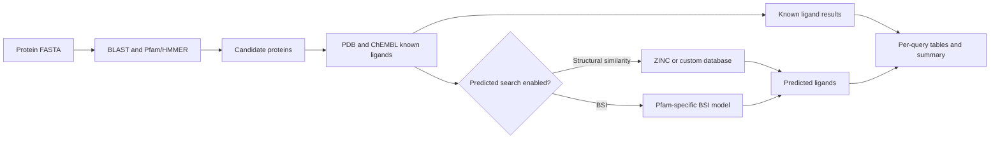

# LigQ2

LigQ2 is a protein-to-ligand discovery platform. Given one or more protein
sequences in FASTA format, it identifies related proteins with ligand evidence,
collects their experimentally supported ligands from PDB and ChEMBL, and can
expand those results with compounds from ZINC or a user-provided database.

> [!IMPORTANT]
> LigQ2 prioritizes candidate compounds computationally. Its results are
> intended for research use and should be validated experimentally before
> biological or therapeutic conclusions are drawn.

## Try LigQ2 online

A restricted public instance is available at
**[LigQ2 Web](https://ligq.infra.cluster.qb.fcen.uba.ar)**. It supports Sequence
and Nearest K protein searches (K <= 10), known-ligands-only searches, and ZINC
compound prioritization using the precomputed Morgan ECFP and FCFP caches.

## Key features

- BLAST sequence similarity and Pfam domain detection with HMMER;
- curated protein-ligand associations from PDB and ChEMBL;
- compound prioritization against ZINC or user-provided databases;
- molecular similarity with RDKit fingerprints or learned embeddings;
- optional Bioactivity Similarity Index (BSI) models for supported protein
  families;
- graphical and command-line interfaces;
- Docker Compose and native Conda execution;
- reusable predicted-ligand caches and updateable database resources.

## Contents

- [Try LigQ2 online](#try-ligq2-online)
- [Quick start](#quick-start)
- [How LigQ2 works](#how-ligq2-works)
- [Choose how to run LigQ2](#choose-how-to-run-ligq2)
- [Local Docker application](#local-docker-application)
- [Native installation and command-line usage](#native-installation-and-command-line-usage)
- [Input and output files](#input-and-output-files)
- [Candidate protein search strategies](#candidate-protein-search-strategies)
- [Compound prioritization methods](#compound-prioritization-methods)
- [Computational performance](#computational-performance)
- [Advanced workflows](#advanced-workflows)
    - [Custom compound databases](#custom-compound-databases)
    - [Additional molecular representations](#additional-molecular-representations)
    - [Database updates](#database-updates)
    - [Cache behavior](#cache-behavior)
    - [Performance tuning and GPU usage](#performance-tuning-and-gpu-usage)
    - [Data layout](#data-layout)
- [Restricted public web deployment](#restricted-public-web-deployment)
- [Native frontend/backend development](#native-frontendbackend-development)
- [Validation and tests](#validation-and-tests)
- [Troubleshooting](#troubleshooting)
- [Reproducibility and publication resources](#reproducibility-and-publication-resources)
- [Data sources](#data-sources)
- [Citation](#citation)
- [License](#license)
- [Support and issue reporting](#support-and-issue-reporting)

New users normally need only the Quick Start, the execution-mode comparison,
one installation path, and the input/output sections. Database rebuilding,
cache administration, public deployment, and application development are
advanced operator or developer workflows. Reviewers can find the scientific
workflow, method definitions, measured performance, and reproducibility notes
in their dedicated sections.

## Quick start

The small functional example in `examples/quickstart.fasta` is intended to
verify that the complete LigQ2 workflow operates correctly. It is not a
performance benchmark.

From the repository root, create the host directory shared with the containers
before starting Docker. This ensures that it remains writable by the local
user:

```bash
mkdir -p work
cp examples/quickstart.fasta work/quickstart.fasta
```

Then download the published Docker images, initialize the complete default data
set, and start the application:

```bash
docker compose pull
./docker/ligq.sh init-data
docker compose up -d
```

The data setup is resumable and downloads only missing files. When it finishes,
open the graphical interface at <http://localhost:8080>.

To also install the optional Morgan Feature FCFP representations and
precomputed cache during setup, replace the `init-data` command above with:

```bash
./docker/ligq.sh init-data --include-fcfp-cache
```

Local searches reuse these downloaded caches when the similarity threshold is
at least 0.4 for ECFP or 0.5 for FCFP. Lower thresholds require LigQ2 to compute
new similarity results and therefore use substantially more time and resources.

Then run the containerized command-line workflow:

```bash
./docker/ligq.sh cli \
  --input-fasta /work/quickstart.fasta \
  --output-dir /work/quickstart_results
```

The Docker CLI stores intermediate files in a disposable subdirectory of its
temporary volume. A custom `--temp-results-dir` can still be supplied and takes
precedence over that Docker default.

The default workflow uses:

- sequence-based and nearest-neighbor candidate recovery;
- nearest K = 5;
- ZINC;
- ECFP4 (`morgan_1024_r2`);
- Tanimoto similarity.

Expected output:

```text
work/quickstart_results/
  search_results_summary.tsv
  search_results/
    <QUERY_ID>/
      protein_ranking.tsv
      known_ligands.tsv
      predicted_ligands.tsv
```

For this functional test, success means:

- the command completes without an unhandled error;
- every input query appears in `search_results_summary.tsv`;
- at least one query produces known ligands and/or prioritized candidate
  compounds.

## How LigQ2 works


```mermaid
flowchart LR
    A[Protein FASTA] --> B[BLAST and Pfam/HMMER]
    B --> C[Candidate proteins]
    C --> D[PDB and ChEMBL known ligands]
    D --> E[Known ligand results]
    D --> F{Predicted search enabled?}
    F -->|Structural similarity| G[ZINC or custom database]
    F -->|BSI| H[Pfam-specific BSI model]
    G --> I[Predicted ligands]
    H --> I
    E --> J[Per-query tables and summary]
    I --> J
```

For each query sequence, the pipeline:

1. detects strict sequence matches, domain-compatible nearest neighbors, and/or
   shared-domain candidates;
2. ranks candidate proteins using BLAST and Pfam/HMMER evidence;
3. retrieves curated ligands associated with those proteins;
4. optionally searches a compound provider using Tanimoto, Cosine similarity,
   or BSI;
5. removes repeated ligands per query by default and preserves the evidence from
   the highest-ranked contributing protein;
6. writes detailed per-query tables and a global summary.

The final protein ranking contains only proteins that contribute at least one
retained known ligand or prioritized candidate compound after per-query
deduplication.

## Choose how to run LigQ2

| Mode | Recommended for | Interface | GPU |
| --- | --- | --- | --- |
| Local Docker application | Most users on Windows, Linux, or macOS | Local web interface and containerized CLI | No; published images are CPU-only |
| Native Conda | Technical users, automation, large searches, and GPU work | Command line | Yes; NVIDIA CUDA |
| Restricted public web application | Quick evaluation without a local installation; operators can host the same restricted mode | [Hosted web interface](https://ligq.infra.cluster.qb.fcen.uba.ar) | No; cached searches only |
| Native frontend/backend | Application developers | Local web development servers | Uses the native pipeline environment |

Docker is the easiest way to run the complete application. The native Conda
workflow exposes every pipeline option and is the recommended route for GPU
execution.

In this document, **local Docker application** means the complete GUI and CLI
running on the user's own computer. **Restricted public deployment** means the
separate server-oriented mode with read-only data, anonymous-session isolation,
and intentionally limited search options. These modes use the same frontend but
do not expose the same capabilities.

> **Docker (CPU) or native installation:** the published images cover the
> standard structural-similarity workflow on CPU. The graphical interface
> requires CUDA for BSI and for generating Hugging Face/ChemBERTa
> representations, so use the native environment with an NVIDIA GPU for those
> workflows. Command-line BSI can run on CPU, but GPU execution is recommended
> for large searches.

## Local Docker application

### Requirements

- Git for cloning and updating the repository;
- Docker Engine with Docker Compose v2 on Linux, or Docker Desktop on Windows
  or macOS;
- Internet access for the container images and first-time data download;
- enough free disk space and memory for the selected databases and workload.

The setup screen divides the initial download into a required database package,
a recommended Morgan ECFP predicted-ligand cache (selected by default), and an
optional Morgan Feature FCFP representation/cache package. It calculates each
package's current missing download size from the official Hugging Face dataset
and compares the selected total with available space. At the 2026-07-24
snapshot, the packages are approximately 5.93 GB, 0.68 GB, and 2.02 GB,
respectively. The normal required-plus-ECFP selection is therefore about 6.61
GB, while selecting all three packages is about 8.63 GB. Container images,
results, temporary files, and future database updates require additional space;
live Hugging Face metadata is the source of truth.

Memory use depends on the number of queries, enabled methods, cache state,
compound database, and worker count. In the benchmark documented under
[Computational performance](#computational-performance), a 100-protein search
against approximately 9 million ZINC compounds used 7.91–9.61 GiB of peak host
memory with eight workers. These are measured workload values, not universal
minimum requirements. For a comparable run, plan for roughly 12 GiB of memory
available to LigQ2; smaller searches generally require less. Docker Desktop
users must also assign enough memory to the Docker virtual machine.

The native and local Docker CLI default to four workers. The restricted public
deployment forces one worker for BLAST/HMMER candidate recovery. Increasing
worker counts can improve throughput but also raises concurrent CPU and memory
use.

The published images target `linux/amd64`. Docker Desktop can run them on other
host architectures through emulation, with a possible performance cost.

> **ChemBERTa and Docker:** the current Docker images are CPU-only. The web
> interface therefore disables generation of Hugging Face/ChemBERTa
> representations. Generating ChemBERTa embeddings on CPU is **strongly
> discouraged**: every compound in both the selected provider and the compatible
> `pdb_chembl` reference must be processed, so a large database can require an
> impractically long run. Use the native Conda installation with a CUDA-capable
> GPU when new ChemBERTa embeddings are required.

### Installation

Clone the repository and enter it:

```bash
git clone https://github.com/gschottlender/LigQ_2.git
cd LigQ_2
```

Create the host-side work directory before Docker starts, then download the
prebuilt images and launch the application. Creating `work/` as the local user
prevents Docker from creating it with root ownership on Linux.

```bash
mkdir -p work
docker compose pull
./docker/ligq.sh start
```

Windows PowerShell:

```powershell
New-Item -ItemType Directory -Force -Path work | Out-Null
docker compose pull
.\docker\ligq.ps1 start
```

Open <http://localhost:8080>.

If port `8080` is already occupied, create a `.env` file from `.env.example` and
change the host port, for example:

```dotenv
LIGQ_WEB_PORT=18080
```

Then start the services again and open <http://localhost:18080>.

The default images are published at:

```text
ghcr.io/gschottlender/ligq-2-api:main
ghcr.io/gschottlender/ligq-2-web:main
```

These `main` images are rebuilt from the repository's `main` branch on every
push. The same builds are also published with the legacy `gui` tag for backward
compatibility.

### First-time data setup

Choose either the graphical or terminal setup method. Both write to the same
Docker database volume, so data downloaded by one method is immediately
available to the other.

If the required databases are missing, the local web application displays
**Initial setup required** instead of the search form. It shows:

- the mandatory database package plus recommended ECFP and optional FCFP cache
  packages;
- the missing-file count and download size for each package;
- the total size of the selected packages;
- free space on the database volume;
- live downloaded GB and completed-file progress.

Select **Download and prepare data**. The backend downloads only missing files
from the selected packages and can resume an interrupted setup. The mandatory
package includes PDB/ChEMBL runtime data, ZINC, BLAST/Pfam resources, and
supported BSI models. The ECFP cache is selected by default; the FCFP
representations/cache package is opt-in. The search interface is enabled
automatically when setup finishes.

Alternatively, initialize the normal required-plus-ECFP data selection from a
terminal:

```bash
./docker/ligq.sh init-data
```

To also install the optional Morgan Feature FCFP representations and cache:

```bash
./docker/ligq.sh init-data --include-fcfp-cache
```

On Windows PowerShell:

```powershell
.\docker\ligq.ps1 init-data
.\docker\ligq.ps1 init-data --include-fcfp-cache
```

### Start, check, and stop the application

Run these helper commands from the repository root. They cover the usual Docker
workflow and do not delete persistent application data.

1. Start the web application in the background:

   ```bash
   ./docker/ligq.sh start
   ```

   When it starts, open <http://localhost:8080>. Running `start` again is safe:
   Docker starts the existing containers or recreates them when necessary.

2. Check whether the containers are running and healthy:

   ```bash
   ./docker/ligq.sh status
   ```

3. Follow the application logs when checking startup or diagnosing an error:

   ```bash
   ./docker/ligq.sh logs
   ```

   Press `Ctrl+C` to stop following the logs. This does not stop the
   application.

4. Stop the application when it is no longer needed:

   ```bash
   ./docker/ligq.sh stop
   ```

   This stops and removes the application containers and their Docker network,
   but preserves the named volumes. A later `start` recreates the containers
   using the same databases, caches, results, uploads, and application state.

The helper commands correspond to `docker compose up -d`, `docker compose ps`,
`docker compose logs -f`, and `docker compose down`, respectively. If Docker
Compose is used directly, `docker compose stop` only pauses the existing
containers; `docker compose up -d` starts them again.

> [!CAUTION]
> Do not run `docker compose down -v` unless you intentionally want to delete
> the Docker volumes containing databases, search history, uploads, caches, and
> application state.

On Windows PowerShell, use the same command names with `.\docker\ligq.ps1`, for
example `.\docker\ligq.ps1 start`.

### Monitor CPU and memory

To observe container resource use at idle and during a search, run:

```bash
docker stats
```

Watch the LigQ2 API container because it executes the pipeline. CPU and memory
normally rise while BLAST, HMMER, or compound retrieval is active and fall when
the application is idle. Press `Ctrl+C` to leave the monitor without stopping
the application.

### Update an existing Docker installation

From the cloned repository, stop the running application, update the checkout
and published images, prepare any newly required data, and start it again:

```bash
git pull --ff-only
./docker/ligq.sh stop
docker compose pull
./docker/ligq.sh init-data
./docker/ligq.sh start
```

The initialization step is resumable and downloads only missing files. Named
volumes preserve existing databases, caches, results, uploads, and application
state throughout the update. If the optional FCFP package was previously
installed, use `init-data --include-fcfp-cache` to validate and update it too.

Developers who changed the checked-out source should replace
`docker compose pull` with `docker compose build` to build images from the
current local code.

### Persistent Docker data

Docker stores large application data outside the images:

| Docker volume or mount | Container path | Purpose |
| --- | --- | --- |
| `ligq_databases` | `/app/databases` | Reference databases, representations, BSI models, predicted caches |
| `ligq_results` | `/app/results` | Search history and final results |
| `ligq_uploads` | `/app/gui/backend/uploads` | Uploaded files used by resource-building jobs |
| `ligq_huggingface` | `/cache/huggingface` | Hugging Face download and model cache |
| `ligq_state` | `/app/state` | Persistent job metadata |
| `ligq_temp` | `/app/temp_results` | Pipeline intermediate files |
| `./work` | `/work` | Files shared directly with the host |

Rebuilding or replacing an image does not delete these volumes.

Docker and native execution deliberately use different data locations:

| Execution path | Database location | Shared with |
| --- | --- | --- |
| Local Docker GUI | `ligq_databases` Docker volume | Docker CLI |
| Docker CLI through `ligq.sh cli` | `ligq_databases` Docker volume | Local Docker GUI |
| Native Conda CLI | `./databases` on the host | Other native runs only |
| Public-mode `start-local-data` test | `./databases` mounted read-only | Native host data |

Therefore, downloading databases during a native CLI search does not install
them into the normal Docker volume, and initializing Docker does not populate
the host's `./databases` directory. Use the Docker CLI when command-line and GUI
runs must share the same downloaded data.

### Run the CLI inside Docker

Place the FASTA file under the repository's `work/` directory, then run:

```bash
./docker/ligq.sh cli --input-fasta /work/queries.fasta --output-dir /work/results
```

PowerShell:

```powershell
.\docker\ligq.ps1 cli --input-fasta /work/queries.fasta --output-dir /work/results
```

The result files appear on the host under `work/results/`. The Docker CLI uses
the CPU image; use the [native Conda workflow](#native-installation-and-command-line-usage)
for GPU searches.

### Using the graphical interface

The graphical interface exposes the main search, result exploration, history,
and resource-management workflows described below.

### Search configuration

The **Run Search** page exposes the main scientific workflow in a constrained,
user-friendly form.

1. Choose **Predicted + known ligands** or **Known ligands only**. Known-only
   searches skip the compound database and compound-prioritization step.
2. For predicted searches, select a compound database.
3. Select a molecular representation. Its compatible metric is detected
   automatically: binary fingerprints use Tanimoto and embeddings use Cosine.
4. Optionally enable BSI.
5. Choose the minimum and maximum score cutoffs.
6. Upload a `.fasta`, `.fa`, or `.faa` protein file.
7. Select one or more candidate-protein methods.
8. Select **Run Search**.

The frontend counts FASTA sequences before submission and displays the count
without imposing a maximum. Large inputs can make the run very long and may
substantially increase resource usage.

An active search can be cancelled beside its job name. LigQ2 waits for the
worker processes to stop and then deletes the uploaded FASTA, temporary files,
and the incomplete result folder; partial results are not retained.

Frontend defaults and constraints:

| Setting | Frontend behavior |
| --- | --- |
| Sequence | Enabled by default |
| Nearest K | Enabled by default; K is restricted to 1–15 and defaults to 5 |
| Domain | Disabled by default |
| Tanimoto minimum cutoff | Cannot be lower than 0.20 |
| Cosine minimum cutoff | Cannot be lower than 0.75 |
| Maximum cutoff | Defaults to 1.00 |

The minimum structural cutoff initially uses the selected representation's
registered pipeline default, rounded upward to two decimal places. The browser
restrictions above do not alter the technical CLI.

### BSI in the frontend

BSI estimates molecular similarity from learned bioactivity patterns.

> [!NOTE]
> BSI through the graphical interface requires a CUDA-capable backend. The
> standard published Docker images are CPU-only, so they cannot run graphical
> BSI searches. Use the native frontend/backend with an NVIDIA GPU, or run BSI
> from the technical CLI where CPU fallback remains available.

When BSI is selected, the frontend:

- fixes the representation to `morgan_1024_r2`;
- changes the metric label to **BSI Score**;
- sets the minimum cutoff to `0.98` and prevents values below `0.97`;
- fixes the maximum cutoff at `1.00`;
- allows Sequence and Nearest K methods;
- clears and disables Domain because domain-wide BSI expansion can be
  prohibitively slow.

BSI is available only when a trained Pfam-specific model exists. The default
model bundle supports:

| Pfam ID | Protein family |
| --- | --- |
| `PF00001` | 7 transmembrane receptor, rhodopsin family |
| `PF00002` | 7 transmembrane receptor, Secretin family |
| `PF00026` | Eukaryotic aspartyl protease |
| `PF00067` | Cytochrome P450 |
| `PF00069` | Protein kinase domain |
| `PF00089` | Trypsin |
| `PF00104` | Ligand-binding domain of nuclear hormone receptor |
| `PF00112` | Papain family cysteine protease |
| `PF00135` | Carboxylesterase family |
| `PF00194` | Eukaryotic-type carbonic anhydrase |
| `PF00209` | Sodium:neurotransmitter symporter family |
| `PF00233` | 3',5'-cyclic nucleotide phosphodiesterase |
| `PF00413` | Matrixin |
| `PF00520` | Ion transport protein |
| `PF00850` | Histone deacetylase domain |
| `PF01094` | Receptor family ligand-binding region |
| `PF07714` | Protein tyrosine and serine/threonine kinase |

Proteins without a supported Pfam family do not produce BSI-prioritized
candidate compounds.

### Follow a running job

Searches and resource-building operations run as background jobs. The frontend
reports the active step, elapsed time, processed items, and ETA when it can be
estimated. During **Preparing predicted ligands**, it shows processed candidate
proteins as `X / total`, including compatible proteins already present in the
cache.

Jobs are queued and processed in submission order. Results are displayed as
queries finish and survive browser refreshes. A backend restart marks an
unfinished job as interrupted, while completed results remain available on
disk.

### Explore and download results

Each FASTA query has up to three result views:

- **Protein Ranking**: ranked proteins that contributed at least one retained
  ligand;
- **Known Bindings**: curated PDB/ChEMBL ligands and their evidence;
- **Predicted Ligands**: compounds retrieved from the selected provider.

The tables support filtering, sorting, column selection, and pagination. Select
a known ligand or prioritized candidate compound to inspect its metadata,
SMILES, and 2D structure.
When available, the detail panel links to the compound's official ZINC20, RCSB
PDB, or ChEMBL page. Pfam binding-site IDs and PDB structure IDs link directly
to their InterPro and RCSB PDB entries. The panel can also export SDF and open
an interactive 3D molecular viewer.
Complete search results can be downloaded from the results interface.

### Search history

Every completed search is stored under the persistent results location. Open
**History** to reload earlier searches without recomputing them. **Clear
history** asks for confirmation and permanently removes old result directories
to free disk space; results belonging to an active search are preserved.

### Manage databases and representations

Under **Manage Resources**:

- **Add new database** imports `.smi`, `.csv`, `.tsv`, or `.parquet` compound
  files and builds the default Morgan representation;
- **Add new representation** builds an RDKit fingerprint or Hugging Face
  embedding for an existing provider and the compatible PDB/ChEMBL reference
  base.

New resources appear in the search form after their background job completes.
Long-running database and representation jobs provide a **Cancel** button with
confirmation. Cancellation stops the worker processes and removes incomplete
job-scoped files. A representation copy that already completed successfully is
kept for reuse; the representation remains hidden from Search until compatible
copies exist in both the selected provider and `pdb_chembl`. A cancelled
database build is removed completely and can be submitted again.
The graphical application enables ChemBERTa/HuggingFace representation builds
only when its backend can execute CUDA operations. The standard CPU Docker image
therefore disables these presets. This guard is GUI-specific: native command-line
generation remains unrestricted and can fall back to CPU.

### Build images locally

Developers who want images built from the current checkout can use:

```bash
mkdir -p work
docker compose build
./docker/ligq.sh start
```

Use `docker compose pull` instead when you want the published images without a
local build.

### Uninstall LigQ2

Open a terminal inside the cloned `LigQ_2` folder. The same commands work on
Linux, macOS, and Windows PowerShell.

To remove the application while keeping the downloaded databases, cache, and
results for a future reinstall:

```bash
docker compose down --remove-orphans --rmi all
```

To remove **all** LigQ2 Docker data and start again from an empty installation:

> [!CAUTION]
> The following command permanently deletes the downloaded databases, predicted
> cache, search history, uploads, and application state.

```bash
docker compose down --volumes --remove-orphans --rmi all
```

Neither option uninstalls Docker itself or deletes the cloned repository. Files
saved under the local `work/` folder are also preserved. To install LigQ2 again,
follow the Docker [Installation](#installation) instructions.

## Native installation and command-line usage

The native workflow is intended primarily for Linux and provides complete CLI
control and CUDA support. Docker is recommended for straightforward
cross-platform use.

### Install the Conda environment

Clone the repository if necessary:

```bash
git clone https://github.com/gschottlender/LigQ_2.git
cd LigQ_2
```

Create and activate the environment:

```bash
conda env create -f environment.yml -n ligq_2_env
conda activate ligq_2_env
```

To update an existing environment:

```bash
conda env update -f environment.yml -n ligq_2_env --prune
```

The environment includes Python, RDKit, BLAST+, HMMER, pandas, NumPy, PyArrow,
Hugging Face Hub, Transformers, and CUDA-enabled PyTorch dependencies.

### Default search

```bash
python run_ligq_2.py \
  --input-fasta queries.fasta \
  --output-dir results
```

If required default data is missing, LigQ2 downloads it automatically from the
Hugging Face dataset `gschottlender/LigQ_2`. The default run:

- enables strict sequence-based and nearest-neighbor candidate recovery;
- uses `--nearest-k 5` and leaves the domain-based strategy disabled;
- searches the `zinc` provider;
- uses `morgan_1024_r2` with Tanimoto;
- chooses the registered representation-specific minimum threshold;
- collapses repeated ligand IDs per query;
- reuses or extends a compatible predicted-ligand cache.

Native downloads are stored under the host's `./databases` directory and are
not copied into the normal Docker database volume.

Use `--skip-hf-predicted-cache` if base data must be downloaded but you do not
want the optional precomputed ZINC cache downloaded. Predictions will then be
computed on demand.

### Known ligands only

```bash
python run_ligq_2.py \
  --input-fasta queries.fasta \
  --output-dir results_known_only \
  --known-only
```

This mode recovers candidate proteins and returns curated PDB/ChEMBL ligands,
but skips provider setup, predicted-cache generation, and compound-database
searches.

### Select candidate methods explicitly

When no method flag is passed, Sequence and Nearest K are enabled. As soon as
any method flag is passed, only the explicitly requested methods are used.

Sequence only:

```bash
python run_ligq_2.py -i queries.fasta -o results_sequence --sequence
```

Sequence, Nearest K, and Domain:

```bash
python run_ligq_2.py \
  -i queries.fasta \
  -o results_all_methods \
  --sequence \
  --nearest_k \
  --nearest-k 10 \
  --domains
```

Domain only:

```bash
python run_ligq_2.py -i queries.fasta -o results_domains --domains
```

### Important CLI options

| Area | Options and defaults |
| --- | --- |
| Input/output | `-i/--input-fasta`, `-o/--output-dir`, `-d/--data-dir databases`, `-t/--temp-results-dir temp_results` |
| Parallel work | `-j/--n-workers 4` |
| Strict sequence | `--min-identity 0.9`, `--min-query-coverage 0.9`, `--min-subject-coverage 0.7` |
| Search sensitivity | `--blast-evalue-max 1e-5`, `--hmmer-evalue-max 1e-5`, `--max-hits 150` |
| Candidate methods | `--sequence`, `--nearest_k`, `--nearest-k 5`, `--domains` |
| Domain expansion | `--max-domain-candidates-per-domain 20` |
| Provider | `--ligand-provider zinc` |
| Similarity | `--search-representation morgan_1024_r2`, `--search-metric tanimoto` |
| Score range | `--search-threshold`, `--search-threshold-max` |
| Device | `--search-device auto`, `cpu`, `cuda`, or `cuda:<index>` |
| Hit limits | `--search-per-iteration-topk 1000`, `--search-global-topk 10000` |
| Output behavior | `--known-only`, `--keep-repeated-ligands` |
| Rebuild controls | `--force-rebuild-known-binding`, `--force-rebuild-protein-domains`, `--force-rebuild-predicted-cache` |

Neither the local frontend nor the CLI caps the FASTA sequence count. The CLI
also does not apply the frontend's K ≤ 15 or minimum-cutoff safety limits. Use
large inputs carefully because runtime, output size, RAM, and cache growth can
increase substantially.

### Keep repeated ligand rows

By default, repeated ligand IDs are collapsed independently for each FASTA
query. To preserve repeated protein-ligand rows:

```bash
python run_ligq_2.py -i queries.fasta -o results --keep-repeated-ligands
```

## Input and output files

### FASTA input

LigQ2 expects protein sequences:

```fasta
>query_1 optional description
MSEQUENCE...
>query_2
MSEQUENCE...
```

The first whitespace-delimited token after `>` is used as the query ID and as
the per-query directory name. Use unique, filesystem-safe identifiers.

### Output layout

```text
<output-dir>/
  search_results_summary.tsv
  search_results/
    <QUERY_ID>/
      protein_ranking.tsv
      known_ligands.tsv
      predicted_ligands.tsv
```

`search_results_summary.tsv` contains one row per FASTA query, including
queries without recovered candidates. A per-query directory is created when
there is candidate or ligand information.

Files with no relevant rows may be absent:

- `known_ligands.tsv` is written when known ligands exist;
- `predicted_ligands.tsv` is written when prioritized candidate compounds exist
  and is never produced in `--known-only` mode;
- `protein_ranking.tsv` can be empty if recovered candidates contribute no
  retained ligand.

### Protein ranking

`protein_ranking.tsv` contains only ligand-contributing proteins. Sequence-based
and nearest-neighbor candidates are ranked by BLAST evidence. Domain-based
candidates with BLAST evidence precede domain-only candidates, which are ranked
by Pfam/HMMER evidence. `n_shared_domains` records shared Pfam domains when
available.

If every ligand from a lower-ranked protein is removed or assigned to a
higher-ranked protein during duplicate-ligand collapse, that protein is omitted
from the final ranking.

### Known ligands

`known_ligands.tsv` contains curated PDB/ChEMBL associations and preserves the
known-binding evidence fields. `search_type` records whether the candidate was
obtained through `sequence`, `nearest_k`, or `domain`.

### Prioritized compounds

`predicted_ligands.tsv` contains prioritized candidate compounds from the
selected provider. Its score column depends on the method:

| Search method | Score columns |
| --- | --- |
| Tanimoto fingerprint | `tanimoto` |
| Cosine embedding | `similarity` |
| BSI | `bsi_score`, `pfam_id` |

When repeated ligand IDs are collapsed, evidence priority is sequence-based,
then nearest-neighbor, then domain-based.

### Global summary

The summary reports ligand-contributing proteins, known ligands, and prioritized
candidate compounds by candidate source:

```text
n_proteins_sequence
n_proteins_nearest_k
n_proteins_domain
n_known_ligands_sequence
n_known_ligands_nearest_k
n_known_ligands_domain
n_predicted_ligands_sequence
n_predicted_ligands_nearest_k
n_predicted_ligands_domain
```

## Candidate protein search strategies

### Sequence-based strategy

`--sequence` uses strict BLAST thresholds to recover closely related reference
proteins. The defaults require 90% identity, 90% query coverage, 70% subject
coverage, and an e-value no greater than `1e-5`.

### Nearest-neighbor strategy

`--nearest_k` builds a broader BLAST-ranked pool, excludes proteins already
accepted as strict sequence-based hits, and retains only proteins sharing at
least one Pfam domain with the query. The final K limit is applied after domain
filtering.

### Domain-based strategy

`--domains` detects Pfam domains with HMMER and expands candidates through
shared domains. Domain-based candidates with BLAST evidence rank above
domain-only matches; domain-only candidates are ranked with Pfam/HMMER
evidence. The number retained for each query domain is controlled by
`--max-domain-candidates-per-domain`.

## Compound prioritization methods

LigQ2 uses curated ligands from each recovered reference protein as molecular
seeds and prioritizes compounds from the selected provider database.

### Fingerprint and Tanimoto searches

```bash
python run_ligq_2.py \
  -i queries.fasta \
  -o results_tanimoto \
  --ligand-provider zinc \
  --search-representation morgan_1024_r2 \
  --search-metric tanimoto
```

### Embedding and cosine searches

The representation must already exist for both `pdb_chembl` and the selected
provider:

```bash
python run_ligq_2.py \
  -i queries.fasta \
  -o results_chemberta \
  --ligand-provider zinc \
  --search-representation chemberta_zinc_base_768 \
  --search-metric cosine \
  --search-device cuda
```

### Score thresholds

An explicit threshold always takes precedence:

```bash
python run_ligq_2.py \
  -i queries.fasta \
  -o results_custom_cutoff \
  --search-threshold 0.5 \
  --search-threshold-max 1.0
```

If `--search-threshold` is omitted, LigQ2 uses these percentile-99.5 defaults:

| Representation | Default minimum |
| --- | ---: |
| `chemberta_zinc_base_768` | 0.936140 |
| `rdkit_1024` | 0.930324 |
| `maccs` | 0.831169 |
| `ap_rdkit` | 0.767087 |
| `morgan_feature_1024_r2` | 0.509451 |
| `topological_torsion_rdkit_1024` | 0.502932 |
| `morgan_1024_r2` | 0.415094 |

An unknown representation requires an explicit `--search-threshold`.
`--search-threshold-max` is inclusive and optional.

### Bioactivity Similarity Index

The Bioactivity Similarity Index is a learned, protein-family-aware molecular
similarity model. It uses bioactivity patterns rather than only structural
overlap.

```bash
python run_ligq_2.py \
  -i queries.fasta \
  -o results_bsi \
  --ligand-provider zinc \
  --bsi \
  --bsi-threshold 0.5
```

BSI:

- always uses `morgan_1024_r2` 1024-bit fingerprints;
- requires `results_databases/protein_domains.parquet`;
- loads models from `<data-dir>/bsi_models/mpg_1024`;
- selects the supported Pfam model with the highest validation PR-AUC when a
  protein matches multiple supported families;
- uses at most `--bsi-max-known-ligands 10` representative seed ligands per
  protein by default;
- reports `bsi_score` and `pfam_id`;
- stores caches under the `<provider>_bsi` namespace.

The technical CLI default is `--bsi-threshold 0.5`. The frontend intentionally
uses a much stricter default of `0.98` and minimum of `0.97` to limit the number
of results. CLI users should select a threshold appropriate for their model,
screening objective, and validation protocol.

GPU-tuned BSI example:

```bash
python run_ligq_2.py \
  -i queries.fasta \
  -o results_bsi_gpu \
  --ligand-provider zinc \
  --bsi \
  --bsi-threshold 0.98 \
  --search-device cuda \
  --search-target-chunk-size 100000 \
  --bsi-model-batch-size 65536 \
  --bsi-max-known-ligands 10
```

## Computational performance

The measurements below come from the manuscript's Supporting Information File
S5, *Computational Performance of LigQ2*. They describe a specific benchmark
and are not runtime guarantees for every system or input.

The benchmark used:

- 100 randomly sampled reviewed human UniProtKB protein sequences;
- the full ZINC in-stock collection of approximately 9 million compounds;
- Sequence and Nearest K with K = 5;
- 1024-bit ECFP4 (`morgan_1024_r2`) fingerprints;
- Tanimoto similarity with a minimum threshold of 0.5;
- eight CPU workers;
- an Intel Core i7-8700 CPU and NVIDIA GeForce RTX 2080 GPU.

All 100 proteins completed evidence recovery. Sixty-nine had transferable
ligand evidence and entered ZINC retrieval; 68 produced at least one prioritized
candidate compound at the selected threshold.

| Scenario | Backend | Cache reuse | Wall-clock time | Time per input protein | Peak host memory | Speedup vs. cache-free CPU |
| --- | --- | --- | ---: | ---: | ---: | ---: |
| First run | CPU | No | 47 min 19.93 s | 28.40 s | 8.26 GiB | 1.00× |
| First run | GPU | No | 20 min 13.23 s | 12.13 s | 9.61 GiB | 2.34× |
| Cached rerun | CPU | Yes | 1 min 01.11 s | 0.61 s | 7.91 GiB | 46.47× |
| Cached rerun | GPU | Yes | 1 min 27.48 s | 0.87 s | 7.91 GiB | 32.46× |

Cache reuse produced the largest improvement because previously computed
protein-level ZINC retrieval results did not need to be generated again.
Smaller custom compound databases and smaller FASTA inputs are expected to run
faster; uncached runtime and memory use increase with workload and configuration.

A separate cache-free CPU comparison used the same ECFP4/Tanimoto settings and
eight workers:

| Candidate strategy | Time per protein with output | Proteins with output | Mean prioritized compounds per protein with output |
| --- | ---: | ---: | ---: |
| Sequence | 20.1 s | 31 | 669 |
| Nearest K | 38.0 s | 66 | 1,572 |
| Domain | 152.1 s | 69 | 5,221 |

Nearest K therefore provided substantially broader coverage than Sequence while
remaining faster and producing more focused output sets than full Domain-based
transfer in this benchmark.

## Advanced workflows

The remaining database, cache, hardware-tuning, deployment, and development
sections are intended for technical users and service operators. They are not
required for a normal LigQ2 search.

### Custom compound databases

LigQ2 accepts CSV, TSV, SMI, and Parquet compound files. CSV/TSV/Parquet files
must provide an ID column and a SMILES column. SMI files use:

```text
SMILES compound_id
```

Build a provider:

```bash
python build_compound_database.py \
  --input-file vendor.csv \
  --output-dir databases \
  --base-name vendor \
  --id-column compound_id \
  --smiles-column SMILES
```

This creates:

```text
databases/compound_data/vendor/
  ligands.parquet
  reps/
    morgan_1024_r2.dat
    morgan_1024_r2.meta.json
```

Search it with:

```bash
python run_ligq_2.py \
  -i queries.fasta \
  -o results_vendor \
  --ligand-provider vendor
```

The automatic Hugging Face setup does not create arbitrary custom providers.
In the frontend, use **Manage Resources → Add new database** for the equivalent
background workflow.

### Additional molecular representations

A representation used for predicted search must exist in both:

```text
databases/compound_data/pdb_chembl/reps/
databases/compound_data/<provider>/reps/
```

Each representation consists of a `.dat` file and matching `.meta.json` file.

#### RDKit fingerprints

Supported kinds are `ap`, `topological_torsion`, `rdkit`, `morgan_feature`, and
`maccs`.

```bash
python add_new_representation.py \
  --output-dir databases \
  --base zinc \
  --representation-type rdkit \
  --rdkit-fp-kind ap \
  --n-bits 1024 \
  --rep-name ap_rdkit \
  --n-jobs 16 \
  --chunksize 500
```

The legacy `--base zinc` path also ensures that the same representation exists
for `pdb_chembl`.

For a custom provider, use:

```bash
python add_new_representation.py \
  --output-dir databases \
  --base-name vendor \
  --ensure-local-compatible \
  --representation-type rdkit \
  --rdkit-fp-kind maccs \
  --n-bits 167 \
  --rep-name maccs
```

#### Hugging Face embeddings

> **GPU strongly recommended:** generating ChemBERTa embeddings on CPU is
> computationally prohibitive for large compound databases and is strongly
> discouraged. The graphical interface requires a usable CUDA GPU for this
> operation. The technical CLI remains unrestricted, but its automatic CPU
> fallback should be used only for small tests or deliberate expert workflows.

```bash
python add_new_representation.py \
  --output-dir databases \
  --base zinc \
  --representation-type huggingface \
  --rep-name chemberta_zinc_base_768 \
  --model-id seyonec/ChemBERTa-zinc-base-v1 \
  --n-bits 768 \
  --batch-size 14
```

Use `--revision <commit-or-tag>` for reproducible model loading. Models that
require repository code additionally need `--trust-remote-code`; only enable it
for code and revisions you trust.

Representations without a registered default search threshold must be used with
an explicit `--search-threshold`.

### Database updates

First-time setup and database updates are different operations:

- setup installs missing files from the published LigQ2 dataset;
- update scripts retrieve current upstream source data and rebuild derived
  resources.

Updates can be long-running and may need substantial temporary disk space. Do
not run searches or resource-building jobs concurrently with an update.

#### Update PDB and ChEMBL with Docker

Stop the application without deleting its volumes:

```bash
docker compose down
```

Run the updater in a temporary container. This command is intentionally written
on one line so it can also be used in PowerShell:

```bash
docker compose --profile tools run --rm --entrypoint python cli /app/update_databases.py --output-dir /app/databases --temp-data-dir /work/update_temp --chembl-version 36
```

Start the application again:

```bash
docker compose up -d
```

The updater refreshes changed PDB and/or ChEMBL data, rebuilds the merged
database, and regenerates:

```text
results_databases/known_binding_data.parquet
results_databases/protein_domains.parquet
```

Because `/app/databases` is the persistent `ligq_databases` volume, rebuilt
resources remain available after the temporary updater container exits.

#### Update ZINC with Docker

```bash
docker compose down
docker compose --profile tools run --rm --entrypoint python cli /app/update_zinc_databases.py --output-dir /app/databases --temp-data-dir /work/update_temp
docker compose up -d
```

By default, the ZINC updater:

- moves existing ZINC representations to
  `compound_data/zinc/old_reps_backup/<timestamp>/`;
- rebuilds ZINC and its default representation;
- moves the existing ZINC predicted cache under
  `results_databases/old_predicted_bindings_backup/zinc/`.

Optional flags:

```text
--keep-existing-reps
--keep-existing-predicted-cache
--download-workers <number>
```

After a ZINC update, rebuild any non-default representations for the new
compound table before using them.

#### Native PDB and ChEMBL update

```bash
conda activate ligq_2_env
python update_databases.py \
  --output-dir databases \
  --temp-data-dir temp_data \
  --chembl-version 36
```

#### Native ZINC update

```bash
conda activate ligq_2_env
python update_zinc_databases.py \
  --output-dir databases \
  --temp-data-dir temp_data
```

#### Prepare caches after a ZINC update

The ZINC updater rebuilds the default Morgan representation and moves the old
ZINC caches aside. Rebuild any additional representations first, then follow
[Precompute a complete predicted cache](#precompute-a-complete-predicted-cache)
for the default ECFP cache and any optional representation-specific cache.

Updating ZINC and precomputing complete caches can take several hours or days.
Do not run searches, database updates, or another cache writer concurrently.
The precompute commands are resumable and can use `--search-device cpu` when
CUDA is unavailable, although CPU cache generation is generally much slower.

#### Rebuild runtime tables from local merged data

Runtime tables can be rebuilt from an existing local merged database:

```bash
python run_ligq_2.py \
  -i queries.fasta \
  -o rebuild_runtime_results \
  --known-only \
  --force-rebuild-known-binding \
  --force-rebuild-protein-domains
```

### Cache behavior

Compound-prioritization searches are incremental. LigQ2 computes results only
for candidate proteins needed by the current run and records them for reuse.

#### Precompute a complete predicted cache

`precompute_predicted_cache.py` builds the shared predicted-ligand cache for
every unique protein in `databases/sequences/target_sequences.fasta` without
running BLAST/HMMER and without creating per-query result folders. It uses the
same providers, representation defaults, cache namespaces, manifests,
fingerprints, locks, and resume behavior as `run_ligq_2.py`.

Precompute the default ECFP/Morgan cache for ZINC on a GPU:

```bash
python precompute_predicted_cache.py \
  --data-dir databases \
  --ligand-provider zinc \
  --search-representation morgan_1024_r2 \
  --search-metric tanimoto \
  --search-threshold 0.4 \
  --search-device cuda
```

Precompute the FCFP/Morgan-feature cache after that representation has been
built for both ZINC and PDB/ChEMBL:

```bash
python precompute_predicted_cache.py \
  --data-dir databases \
  --ligand-provider zinc \
  --search-representation morgan_feature_1024_r2 \
  --search-metric tanimoto \
  --search-threshold 0.5 \
  --search-device cuda
```

Any installed representation supported by `run_ligq_2.py` can be selected. It
must have matching `.dat` and `.meta.json` files in both the target provider and
`compound_data/pdb_chembl`. When `--search-threshold` is omitted, the registered
representation-specific default is used; representations without a registered
default require an explicit value. Use `--search-metric cosine` for compatible
embedding representations.

The command is incremental. Run it again with the same provider,
representation, metric, and threshold coverage to resume or verify an existing
cache. `--force-rebuild-predicted-cache` deliberately discards the exact
requested namespace before starting again. An optional `--protein-fasta` can
replace the default protein universe.

On completion, the command verifies that every requested protein appears in
`cached_proteins.json`, including proteins that were processed but produced no
prioritized candidate compounds. A wider cache built at a lower minimum
threshold can serve later searches with stricter cutoffs.

Structural similarity caches use:

```text
databases/results_databases/predicted_bindings/<provider>/
  search_representation=<representation>__search_metric=<metric>__cache_threshold_min=<threshold>[__cache_threshold_max=<threshold>]/
    predicted_binding_data.parquet
    predicted_binding_progress.json
    cached_proteins.json
    predicted_binding_rowgroup_index.json
    manifest.json
    .cache.lock
```

- ZINC uses the `zinc` namespace.
- Custom providers use their provider name.
- BSI uses `<provider>_bsi`, such as `zinc_bsi`.

The manifest validates provider, representation, metric, threshold coverage,
method-specific settings, and the target database fingerprint. A cache built at
a lower minimum threshold can serve a stricter query when all other compatibility
checks pass. For example, a cache covering Morgan/Tanimoto scores from `0.4` can
serve the default `0.415094` search without recomputation.

Structural database fingerprints are portable across downloads, Docker volumes,
copies, and backup restores: file modification times are not part of their
identity. Legacy Hugging Face cache manifests are upgraded in place only when
the downloaded database inputs and cache artifacts are unchanged files from the
same dataset revision. `update_databases.py` invalidates all predicted caches
after PDB/ChEMBL changes, while `update_zinc_databases.py` moves the affected
`zinc` and `zinc_bsi` namespaces aside before rebuilding ZINC.

`.cache.lock` prevents simultaneous writers. `--force-rebuild-predicted-cache`
discards and regenerates the compatible namespace selected for the run.

#### Remove obsolete predicted caches

Predicted-ligand caches are derived data. They can be deleted without removing
the compound databases or molecular representations; LigQ2 downloads or
recomputes the required cache the next time it is needed. That first search can
therefore be substantially slower.

The web interface's **Clear history** action removes saved search runs, not
these shared predicted-ligand caches.

A cache is normally safe to remove when its provider or representation is no
longer used, or when an update has moved it into an `old_*_backup` directory.
Do not classify a cache as obsolete only because its minimum cutoff differs
from the current search: a cache built with a lower cutoff can also serve
stricter searches. Incompatible cache manifests are ignored automatically.

> [!CAUTION]
> Stop running searches, database updates, and cache precomputation before
> deleting cache files. Do not delete the active `compound_data/<provider>/reps`
> directory or other database files. A leftover `.cache.lock` from a dead
> process is detected and removed automatically.

For a native installation, first inspect the available namespaces:

```bash
find databases/results_databases/predicted_bindings -mindepth 1 -maxdepth 2 -type d -print
du -sh databases/results_databases/predicted_bindings/* 2>/dev/null
```

Delete one exact cache directory by replacing both placeholders with names from
the listing above:

```bash
rm -rf "databases/results_databases/predicted_bindings/<provider>/<exact-cache-directory>"
```

Alternatively, remove all structural and BSI predicted caches for ZINC. The
directories are recreated when they are next required:

```bash
rm -rf databases/results_databases/predicted_bindings/zinc
rm -rf databases/results_databases/predicted_bindings/zinc_bsi
```

After confirming that an updated ZINC database works correctly, its inactive
backup copies can also be removed:

```bash
rm -rf databases/results_databases/old_predicted_bindings_backup
rm -rf databases/compound_data/zinc/old_reps_backup
```

With Docker, operate on the persistent database volume through a temporary CLI
container. These commands work without locating the volume on the host:

```bash
docker compose down
docker compose --profile tools run --rm --entrypoint sh cli -c 'find /app/databases/results_databases/predicted_bindings -mindepth 1 -maxdepth 2 -type d -print'
docker compose --profile tools run --rm --entrypoint sh cli -c 'rm -rf "/app/databases/results_databases/predicted_bindings/<provider>/<exact-cache-directory>"'
docker compose up -d
```

To remove all ZINC structural and BSI caches, replace the single-cache removal
command with:

```bash
docker compose --profile tools run --rm --entrypoint sh cli -c 'rm -rf /app/databases/results_databases/predicted_bindings/zinc /app/databases/results_databases/predicted_bindings/zinc_bsi'
```

To remove only the inactive update backups, use:

```bash
docker compose --profile tools run --rm --entrypoint sh cli -c 'rm -rf /app/databases/results_databases/old_predicted_bindings_backup /app/databases/compound_data/zinc/old_reps_backup'
```

Do not use `docker compose down -v` for cache cleanup: `-v` removes all LigQ2
volumes, including the downloaded databases, representations, results, uploads,
and application state. The separate Hugging Face download cache is normally
best retained because removing it can force large files to be downloaded again.

### Performance tuning and GPU usage

#### Verify CUDA

The native environment includes CUDA-enabled PyTorch packages. A compatible
NVIDIA driver and visible GPU are still required:

```bash
nvidia-smi
python -c "import torch; print('CUDA available:', torch.cuda.is_available()); print('Devices:', torch.cuda.device_count())"
```

Select the device with:

```text
--search-device auto
--search-device cpu
--search-device cuda
--search-device cuda:0
```

`auto` uses CUDA only when a usable device is detected and otherwise falls back
to CPU. An explicitly requested but unusable CUDA device is also resolved
safely by the device helper.

#### GPU structural search

```bash
python run_ligq_2.py \
  -i queries.fasta \
  -o results_gpu \
  --search-device cuda \
  --search-target-chunk-size 100000 \
  --search-query-batch-size 32
```

Start with smaller chunk and batch sizes if VRAM is limited. Larger values can
increase throughput but also increase memory consumption.

#### Other performance controls

- `--n-workers` controls CPU parallelism for BLAST and related work.
- `--search-target-chunk-size` controls the number of provider compounds scored
  per chunk.
- `--search-query-batch-size` controls molecular seed batching.
- `--search-per-iteration-topk` limits retained hits for each search chunk.
- `--search-global-topk` limits retained predicted hits per protein.
- `--bsi-model-batch-size` controls neural-model inference batches.
- `--block3-query-chunk-size` and
  `--block3-predicted-filter-batch-size` limit memory during per-query result
  generation.

The temporary result directory contains useful BLAST, HMMER, and candidate
mapping intermediates. Use a unique `--temp-results-dir` when launching native
CLI runs concurrently. Predicted-cache writes remain serialized by their lock.

#### BSI benchmark

```bash
python benchmark_bsi_search.py \
  --data-dir databases \
  --ligand-provider zinc \
  --device cuda \
  --target-limit 100000 \
  --seed-counts 1,5,10 \
  --target-chunk-sizes 25000,50000,100000 \
  --model-batch-sizes 32768,65536
```

Use `--target-limit 0` to benchmark the complete provider. Output includes
elapsed time, throughput, hit count, peak RAM, and peak VRAM.

### Data layout

The default data root is `databases` and can be changed with `--data-dir`.

```text
databases/
  db_metadata.json
  sequences/
    target_sequences.fasta
    target_sequences.pkl
  merged_databases/
    binding_data_merged.parquet
    ligs_smiles_merged.parquet
    uncurated_binding_data.parquet
  results_databases/
    known_binding_data.parquet
    protein_domains.parquet
    predicted_bindings/
  compound_data/
    pdb_chembl/
      ligands.parquet
      reps/
    zinc/
      ligands.parquet
      reps/
  complementary_databases/
    blast/
    pfam/
  bsi_models/
    mpg_1024/
```

Regular searches read runtime-ready files from `results_databases/`.
`merged_databases/` is required when rebuilding those runtime tables locally.

The canonical published data is available at:

<https://huggingface.co/datasets/gschottlender/LigQ_2/tree/main>

## Restricted public web deployment

A hosted instance of this restricted mode is available at
**[ligq.infra.cluster.qb.fcen.uba.ar](https://ligq.infra.cluster.qb.fcen.uba.ar)**.
The deployment instructions below are intended for operators hosting an
equivalent limited anonymous service; users of the hosted instance do not need
to run them. The repository provides an isolated, fail-closed deployment mode
that leaves the local application unchanged while exposing only ZINC ECFP/FCFP
cached searches and an optional Known ligands only search.

The public mode provides anonymous-session isolation, server-side FASTA limits,
rate limiting, a search timeout, short result retention, and read-only database
mounts. BSI and resource management are unavailable. Protein recovery is
limited to Sequence and Nearest K, Nearest K is capped at 10, and Domain search
is unavailable.

The backend validates the mandatory databases and both ECFP/FCFP caches during
startup and warms its readiness cache before accepting traffic. Public search
jobs run BLAST and HMMER with a single worker so the pipeline matches a one-CPU
deployment limit.

Local testing can reuse an existing native `./databases` directory as a
read-only mount:

```bash
./docker/ligq-web.sh start-local-data
```

This command never creates or downloads the host data. To use databases managed
in an isolated Docker volume instead, prepare them first and then start the
service:

```bash
./docker/ligq-web.sh prepare
./docker/ligq-web.sh start
```

## Native frontend/backend development

For application development, update and activate the native pipeline
environment, then start the API:

```bash
conda env update -f environment.yml -n ligq_2_env --prune
conda activate ligq_2_env
cd gui/backend
./start.sh
```

The API is served at <http://127.0.0.1:8000>, with interactive documentation at
<http://127.0.0.1:8000/api/docs>.

In another terminal, use Node.js `^20.19.0` or `>=22.12.0`:

```bash
cd gui/frontend
npm ci
npm run dev
```

Open <http://localhost:5173>. Vite proxies `/api` to the local FastAPI backend.

## Validation and tests

Use the [Quick start](#quick-start) as the end-to-end functional smoke test. It
exercises data preparation, protein candidate recovery, known-ligand retrieval,
compound prioritization, and result generation through the packaged Docker
workflow.

After activating the native Conda environment, install the development-only
test runner once and run the focused pipeline and backend tests with:

```bash
python -m pip install pytest
python -m pytest tests gui/backend/tests
```

With Node.js `^20.19.0` or `>=22.12.0`, validate frontend source and the
production bundle with:

```bash
npm --prefix gui/frontend run lint
npm --prefix gui/frontend run build
```

Validate Docker Compose interpolation and service definitions without starting
containers:

```bash
docker compose config --quiet
docker compose -f compose.web.yml config --quiet
```

The frontend currently has lint/build validation but no automated browser test
suite. Do not interpret these commands as experimental validation of predicted
ligands; LigQ2 outputs remain computational hypotheses requiring independent
biological evaluation.

## Troubleshooting

### Port 8080 is already allocated

Set a different port in `.env`:

```dotenv
LIGQ_WEB_PORT=18080
```

Then run `docker compose up -d` and open <http://localhost:18080>.

### The `work/` directory is not writable

Create `work/` before the first Docker startup. If Docker already created it as
root on Linux, stop LigQ2 and restore ownership only for that directory:

```bash
./docker/ligq.sh stop
sudo chown -R "$(id -u):$(id -g)" work
```

Then copy input files into `work/` and start the application again. Do not apply
recursive ownership changes to the repository or a broader parent directory.

### Docker reports insufficient disk space

Inspect Docker usage:

```bash
docker system df
docker info --format '{{.DockerRootDir}}'
```

Docker images, writable layers, and named volumes use Docker's data-root, which
may differ from the repository disk. Move Docker's data-root through the Docker
Engine or Docker Desktop configuration if necessary. Do not delete LigQ volumes
unless their data is no longer needed.

### The frontend still shows Initial setup required

Check service health and setup logs:

```bash
docker compose ps
docker compose logs -f api
```

You can resume setup with `./docker/ligq.sh init-data` or its PowerShell
equivalent. Missing files are downloaded; completed files are retained.

### Docker asks for data that was already downloaded natively

This is expected because native runs use the host's `./databases` directory,
whereas the normal Docker GUI and Docker CLI use the `ligq_databases` named
volume. Run `./docker/ligq.sh init-data` to populate the Docker volume. After
that, both the Docker GUI and `./docker/ligq.sh cli` reuse the same data.

### A representation is not listed

The representation must have both `.dat` and `.meta.json` files in the selected
provider and in `pdb_chembl`. Re-run **Add new representation** or
`add_new_representation.py` with compatible settings for both databases.

### CUDA is not used

Confirm `torch.cuda.is_available()` in the activated Conda environment and pass
`--search-device cuda`. The current Docker images intentionally install
CPU-only PyTorch and cannot use a host GPU.

### A BSI protein produces no prioritized candidate compounds

Confirm that the protein has a Pfam family supported by the installed BSI model
bundle and that its known ligand seeds pass preprocessing. Unsupported proteins
are skipped by design.

### A protein candidate is absent from Protein Ranking

Protein Ranking reports ligand contributors, not every intermediate candidate.
A recovered protein is omitted when it contributes neither a retained known
ligand nor a prioritized candidate compound, including cases where all its
ligand IDs were assigned to a higher-ranked protein during deduplication.

## Reproducibility and publication resources

- Source code: <https://github.com/gschottlender/LigQ_2>
- Processed databases and precomputed resources:
  <https://huggingface.co/datasets/gschottlender/LigQ_2>
- Target-specific benchmark datasets:
  <https://huggingface.co/datasets/gschottlender/LigQ_2_benchmark>

The `main` source branch, `main` container tags, and Hugging Face `main` dataset
revision are convenient moving targets, not immutable releases. For a
reproducible analysis, record:

- the Git commit or stable software release;
- the container image tag or digest when Docker is used;
- the Hugging Face dataset revision and local `db_metadata.json` contents;
- the complete command line or exported GUI configuration;
- input FASTA files and custom compound databases;
- representation, metric, thresholds, candidate methods, K, worker count, and
  device;
- operating system, CPU, GPU, RAM, and measured runtime.

A stable software release identifier and formal publication citation will be
added when they become available. Until then, cite the repository together with
the exact Git commit used for the analysis.

## Data sources

- [RCSB Protein Data Bank](https://www.rcsb.org/)
- [ChEMBL](https://www.ebi.ac.uk/chembl/)
- [UniProt](https://www.uniprot.org/)
- [Pfam](https://www.ebi.ac.uk/interpro/entry/pfam/)
- [ZINC20](https://zinc20.docking.org/)

The processed default dataset is distributed through
[gschottlender/LigQ_2 on Hugging Face](https://huggingface.co/datasets/gschottlender/LigQ_2).

The repository's MIT license covers LigQ2 source code. Upstream database and
model resources remain subject to their respective licenses and terms of use;
users are responsible for checking those terms for redistribution and intended
applications.

LigQ2 is under active development. Pin repository revisions, model revisions,
container tags, and database versions when strict reproducibility is required.

## Citation

> LigQ2 v1.0.0 — https://doi.org/10.5281/zenodo.21796114

## License

> LigQ2 is distributed under the MIT License. See [LICENSE](LICENSE).

## Support and issue reporting

Questions, bug reports, and feature requests can be submitted through the
[LigQ2 GitHub issue tracker](https://github.com/gschottlender/LigQ_2/issues).
