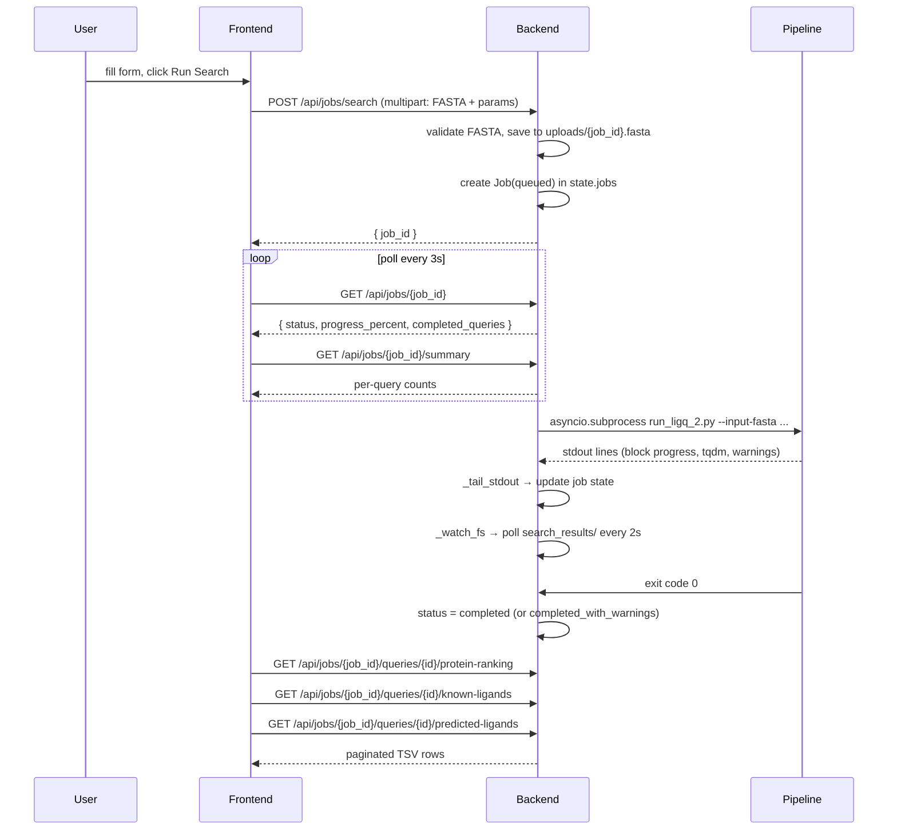

# LigQ 2 GUI — Architecture

This document describes how the GUI layers connect to each other and to the
root-level pipeline. It is intended for technical reviewers unfamiliar with
the codebase.

---

## 1. Overview

LigQ 2 has three layers:

```
┌─────────────────────────────────────────────────────────┐
│  Frontend  (gui/frontend/)                              │
│  React 19 + TypeScript + Vite · runs in the browser    │
└────────────────────┬────────────────────────────────────┘
                     │  HTTP / JSON  (Vite proxy → port 8000)
┌────────────────────▼────────────────────────────────────┐
│  Backend  (gui/backend/)                                │
│  FastAPI + asyncio · orchestrates jobs and serves data  │
└────────────────────┬────────────────────────────────────┘
                     │  asyncio.create_subprocess_exec
┌────────────────────▼────────────────────────────────────┐
│  Pipeline  (repository root)                            │
│  prepare_ligq_2_data.py · run_ligq_2.py                 │
│  build_compound_database.py · add_new_representation.py │
└─────────────────────────────────────────────────────────┘
```

The backend never imports pipeline code directly. It launches pipeline scripts
as child processes and parses their stdout in real time.

---

## 2. Frontend → Backend connection

### API base URL and proxy

`gui/frontend/src/lib/api.ts` creates a single shared Axios instance:

```ts
export const api = axios.create({ baseURL: '/api', timeout: 30_000 });
```

The base URL `/api` is relative, so in development the Vite dev server proxies
it to `http://localhost:8000` via `gui/frontend/vite.config.ts`:

```ts
server: {
  proxy: { '/api': 'http://localhost:8000' },
}
```

All components import `api` from `src/lib/api.ts` — there are no other HTTP
clients or hardcoded URLs.

### API calls by feature

#### Search

| Method | Endpoint | Caller |
|---|---|---|
| `POST` | `/api/jobs/search` | `Sidebar.tsx` |
| `GET` | `/api/jobs/{job_id}` | `VisualizeResults.tsx` (polling) |
| `GET` | `/api/jobs/{job_id}/summary` | `VisualizeResults.tsx` |

The search form is submitted as `multipart/form-data` (FASTA file + form
fields). BSI mode adds `use_bsi=true` and `bsi_threshold` (default `0.98`);
structural mode sends `search_threshold` and `search_threshold_max` instead.
The response contains a `job_id` that the frontend stores in state.

#### Result tables

| Method | Endpoint | Caller |
|---|---|---|
| `GET` | `/api/jobs/{job_id}/queries/{query_id}/protein-ranking` | `ProteinRankingTable.tsx` |
| `GET` | `/api/jobs/{job_id}/queries/{query_id}/known-ligands` | `KnownBindingsTable.tsx` |
| `GET` | `/api/jobs/{job_id}/queries/{query_id}/predicted-ligands` | `PredictedLigandsTable.tsx` |

All table endpoints accept `page`, `per_page`, `filters`, `sort_by`, and
`sort_dir` query parameters and return paginated results.

#### Downloads

| Method | Endpoint | Caller |
|---|---|---|
| `GET` | `/api/jobs/{job_id}/download` | `VisualizeResults.tsx` |
| `GET` | `/api/jobs/{job_id}/queries/{query_id}/download` | `ResultsPanel.tsx` |

Responses are `application/zip` streams.

#### Databases and representations

| Method | Endpoint | Caller |
|---|---|---|
| `GET` | `/api/databases` | `DatabaseContext.tsx` (on mount) |
| `GET` | `/api/databases/{name}/representations` | `DatabaseContext.tsx` |
| `GET` | `/api/system/capabilities` | `AddNewRepresentation.tsx` (on mount) |

#### Initial setup

| Method | Endpoint | Caller |
|---|---|---|
| `GET` | `/api/setup/status` | `InitialSetupGate.tsx` (on mount and after completion) |
| `POST` | `/api/setup/download` | `InitialSetupGate.tsx`; JSON selects ECFP/FCFP cache packages |
| `GET` | `/api/jobs/{job_id}` | `InitialSetupGate.tsx` (1-second polling) |

The setup gate remains in front of all application views while required default
data is missing. Status inspection obtains three package file lists and sizes
from the Hugging Face repository: mandatory databases, the default-selected
Morgan ECFP cache, and the optional Morgan Feature FCFP representations/cache.
It compares them with `databases/` and reports per-package remaining downloads
plus free space on that filesystem. The setup request sends
`include_ecfp_cache` and `include_fcfp_cache`; the mandatory package cannot be
deselected. After a successful job, `DatabaseContext.refetchDatabases()` makes
the newly installed ZINC database and representations available without a page
reload.

While the setup job is active, its structured progress includes aggregate
`downloaded_bytes`/`download_total_bytes` and
`completed_files`/`total_files`. Byte callbacks from concurrent Hugging Face
downloads are throttled before being emitted, while every completed file forces
an immediate update.

#### File upload

| Method | Endpoint | Caller |
|---|---|---|
| `POST` | `/api/files/upload` | `AddNewDatabase.tsx` |

Returns `{ file_id, filename, columns }`. Used to preview column names before
building a database.

#### Job submission

| Method | Endpoint | Caller |
|---|---|---|
| `POST` | `/api/jobs/build-database` | `AddNewDatabase.tsx` |
| `POST` | `/api/jobs/add-representation` | `AddNewRepresentation.tsx` |

#### History

| Method | Endpoint | Caller |
|---|---|---|
| `GET` | `/api/results` | `VisualizeResults.tsx` (History panel) |
| `DELETE` | `/api/results` | `VisualizeResults.tsx` (Clear history confirmation) |

### Polling strategy

After submitting a search or a background job, the frontend polls
`GET /api/jobs/{job_id}` on a fixed `setInterval` of **3 000 ms**. The
interval clears itself when the job reaches a terminal status:
`completed`, `completed_with_warnings`, or `failed`.

During a search, `VisualizeResults.tsx` also polls
`GET /api/jobs/{job_id}/summary` on the same interval to show incremental
per-query results as they are written to disk.

---

## 3. Backend → Pipeline connection

### Subprocess invocation

`gui/backend/services/job_runner.py` launches all pipeline scripts via:

```python
asyncio.create_subprocess_exec(
    sys.executable,          # same Python interpreter as uvicorn
    *args,
    stdout=asyncio.subprocess.PIPE,
    stderr=asyncio.subprocess.PIPE,
    cwd=str(PIPELINE_ROOT),  # repository root as working directory
    limit=1024 * 1024 * 10,  # 10 MB line buffer
    env=_subprocess_env(),  # unbuffered output + Conda runtime libraries
)
```

Using `sys.executable` ensures the subprocess inherits the same conda
environment that uvicorn was started in, without any activation step.
`_subprocess_env()` also prepends `CONDA_PREFIX/lib` to `LD_LIBRARY_PATH`, so
compiled packages such as RDKit load the C++ runtime shipped with that environment.

### Script called per job type

| Job type | Script |
|---|---|
| `setup` | `prepare_ligq_2_data.py` |
| `search` | `run_ligq_2.py` |
| `build_database` | `build_compound_database.py` |
| `add_representation` | `add_new_representation.py` |

The setup script uses Hugging Face metadata to select only missing files from
the requested packages and downloads them with `local_dir=databases`. This
avoids overwriting existing local data and avoids retaining a second full copy
in the user's global Hugging Face cache. Its mandatory set includes the default
structural-search resources and Pfam-specific BSI models exposed by the GUI.
The ECFP cache package adds compatible Morgan/Tanimoto predictions with minimum
coverage `0.4`; the FCFP package adds both compatible representations and its
predictions with minimum coverage `0.5`.
The downloaded structural-cache manifest is portable across the Docker volume:
local file modification times do not invalidate it. Older manifests are migrated
only when Hugging Face metadata confirms that all database inputs and cache
artifacts are unchanged files from the same dataset revision.

### Argument construction (`gui/backend/routers/jobs.py`)

#### `search`

```python
args = [
    "run_ligq_2.py",
    "--input-fasta",          str(fasta_path),       # saved to UPLOADS_DIR
    "--output-dir",           str(output_dir),        # results/{stem}_{timestamp}/
    "--ligand-provider",      ligand_provider,
    "--search-representation", search_representation,
    "--search-metric",        search_metric,
    "--progress-json",
]
# Optional flags
if use_bsi:
    args += ["--bsi", "--bsi-threshold", str(bsi_threshold)]
else:
    if search_threshold: args += ["--search-threshold", str(search_threshold)]
    if search_threshold_max: args += ["--search-threshold-max", str(search_threshold_max)]
if use_sequence:        args.append("--sequence")
if use_nearest_k:       args += ["--nearest_k", "--nearest-k", str(nearest_k)]
if use_domains:         args.append("--domains")
if known_only:          args.append("--known-only")
```

For BSI searches the backend treats the browser values as advisory and forces
`morgan_1024_r2` plus the CLI-compatible `tanimoto` metric argument; the BSI
provider itself reports `bsi_score`. The GUI default BSI cutoff is `0.98`, and
the structural minimum/maximum cutoff arguments are omitted. The frontend checks
`GET /api/system/capabilities` and enables BSI only when CUDA is usable. The search
endpoint repeats that check and returns `422 gpu_required` for direct BSI requests
without CUDA; this restriction does not apply to command-line runs.

#### `build_database`

```python
args = [
    "build_compound_database.py",
    "--input-file",  str(upload_path),   # saved to UPLOADS_DIR with UUID name
    "--base-name",   base_name,
    "--progress-json",
    "--staging-token", job_id,
]
# For CSV/TSV/Parquet only (not .smi):
if suffix != ".smi":
    args += ["--id-column", id_column, "--smiles-column", smiles_column]
```

#### `add_representation`

```python
args = [
    "add_new_representation.py",
    "--output-dir",          "databases",
    "--representation-type", body.representation_type,
    "--n-bits",              str(body.n_bits),
    "--rep-name",            body.rep_name,
    "--progress-json",
    "--staging-token",       job_id,
]
if rdkit:   args += ["--rdkit-fp-kind", body.rdkit_fp_kind]
if hf:      args += ["--model-id", body.model_id]
if batch:   args += ["--batch-size", str(body.batch_size)]
if n_jobs:  args += ["--n-jobs", str(body.n_jobs)]

# Built-in bases use --base; custom databases use --base-name + compatibility flag
if body.base_name in ("zinc", "local"):
    args += ["--base", body.base_name]
else:
    args += ["--base-name", body.base_name, "--ensure-local-compatible"]
```

### Stdout parsing (`job_runner.py`)

`_tail_stdout` reads the subprocess stdout line by line and updates the in-memory
job record. GUI-launched scripts receive `--progress-json` and emit newline
events prefixed with `LIGQ_PROGRESS `. Each JSON payload is validated as
`JobProgress` and includes:

```text
step, label, step_index, step_count, percent,
current, total, unit, context, eta_seconds,
downloaded_bytes, download_total_bytes, completed_files, total_files
```

The frontend renders the current step, overall percentage, processed/total
count, ETA, and elapsed time for standard jobs. BSI searches deliberately render
only the active step and its position in the pipeline because per-protein runtime
makes percentage and ETA estimates misleading. Structured percentages remain
monotonic in the API. A parsed `tqdm` line may enrich the current structured step
with count and ETA, but it does not replace the script's overall percentage.

During `predicted_cache`, `ensure_provider_cache()` reports cached requested
proteins as the initial count and `build_predicted_binding_data_incremental()`
advances the structured event after every remaining protein. The existing CLI
`Predicted proteins` tqdm display remains available independently on stderr.

The previous block, tqdm, and representation-build regexes remain as a legacy
fallback for scripts launched without structured events.

### Resource cancellation and transactional files

`DELETE /api/jobs/{job_id}` marks an active job as `cancelled`, terminates its
process group, waits for exit, and then removes job-scoped artifacts. Resource
jobs use the UUID as a staging token:

- database builds run under `.base_name.building.<job_id>` and are atomically
  promoted only after the ligand table and default representation finish;
- representation builders write `.partial.<job_id>` files and publish the
  `.dat`/`.meta.json` pair atomically for each database phase;
- a completed representation phase is preserved when a later compatibility
  phase is cancelled, but partial phases are removed;
- the uploaded build source is removed on completion, failure, cancellation,
  or backend interruption.

Publishing markers make cleanup safe if cancellation happens between atomic
renames. Cleanup accepts only validated job tokens and only removes matching
paths below the configured compound-data and upload roots. Persisted failed,
cancelled, or interrupted resource jobs are cleaned again at backend startup;
completed jobs have their ownership markers finalized. Terminal state changes
are conditional, so completion and cancellation cannot overwrite each other
during a process-exit race.

### Hardware capabilities and GUI-only GPU guard

`GET /api/system/capabilities` probes CUDA from the backend Python environment
with a minimal Torch operation and returns `cuda_available` plus the detected
device name. **Add new representation** disables HuggingFace/ChemBERTa presets
unless that probe succeeds. `POST /api/jobs/add-representation` repeats the
guard for graphical requests and returns `gpu_required` with HTTP 422 when CUDA
is unavailable. The root `add_new_representation.py` command is intentionally
unchanged, so technical command-line users retain the CPU fallback.

**`_WARNING_TOKENS`** — any line containing `"warning"`, `"no domains found"`,
`"no known ligands"`, or `"skipped"` is appended to the job's `warnings` list
and eventually results in `completed_with_warnings` status.

`_tail_stderr` runs concurrently and logs all stderr lines at INFO level
(no job state updates).

For search jobs, `_watch_fs` runs as a parallel asyncio task. It polls the
`search_results/` output directory every 2 seconds and updates
`completed_queries` as per-query directories appear on disk. It only estimates
`progress_percent` when the job has not emitted structured progress.

---

## 4. Backend → Filesystem connection

### Key paths (`gui/backend/core/config.py`)

```python
PIPELINE_ROOT    = Path(__file__).resolve().parents[3]
#                  gui/backend/core/config.py → 3 levels up → repository root

DATABASES_DIR    = PIPELINE_ROOT / "databases"
COMPOUND_DATA_DIR = DATABASES_DIR / "compound_data"
RESULTS_DIR      = PIPELINE_ROOT / "results"
UPLOADS_DIR      = PIPELINE_ROOT / "gui" / "backend" / "uploads"

ALLOWED_ORIGINS  = os.environ.get("ALLOWED_ORIGINS",
                       "http://localhost:5173,http://localhost:3000").split(",")
```

`PIPELINE_ROOT` resolves at import time from the location of `config.py` — no
environment variable is required.

### Result reading (`gui/backend/services/tsv_reader.py`)

**`read_tsv_paginated(path, page, per_page, filters, sort_by, sort_dir)`**  
Reads a TSV file with `pd.read_csv(path, sep="\t")`, applies column filters,
sorts, and returns a page slice. Columns named `binding_sites` and `pdb_ids`
are deserialized from Python-list, NumPy-style, comma-separated, or
semicolon-separated strings into Python lists.
`NaN` values are converted to `None` for JSON serialization.

**`read_summary(output_dir)`**  
Reads `search_results_summary.tsv` if it exists; otherwise builds an
incremental summary by scanning the `search_results/` subdirectories.

### Database and representation discovery (`gui/backend/services/fs_inspector.py`)

**`list_databases()`**  
Scans `COMPOUND_DATA_DIR`, excludes `pdb_chembl` (internal reference database
not exposed to users), and returns directories that contain a `ligands.parquet`
file.

**`list_representations(db_name)`**  
Lists only search-ready representations. A representation is search-ready when
both `{name}.dat` and `{name}.meta.json` exist under the selected database's
`reps/` directory and under `pdb_chembl/reps/`. Incomplete builds stay out of
the search selector and can be submitted again from Add new representation.
For each valid representation, calls `get_metric_from_manifest()` to determine
the similarity metric and loads its optional default cutoff from
`search_threshold_defaults.json`.
The search sidebar rounds this default upward to two decimal places and exposes
both cutoff controls in `0.01` increments. It applies frontend-only minimums of
`0.2` for Tanimoto representations and `0.75` for Cosine representations; the
shared pipeline and backend validation remain unchanged.
The browser counts FASTA headers after upload and displays the count, but the
local frontend does not impose a maximum sequence count. Large inputs can
significantly extend job runtime and resource usage.
The Nearest K numeric control is likewise constrained only in the frontend to
integer values from `1` through `15`; the API and CLI remain unchanged.
When BSI is enabled, the sidebar fixes the representation to `morgan_1024_r2`,
shows `BSI Score`, uses a separate minimum cutoff initialized to `0.98` and
bounded below at `0.97`, and disables the maximum cutoff at `1.0`. It also clears
and disables Domain search, leaving Sequence and Nearest K as the only selectable
methods. This method restriction is frontend-only. Disabling BSI restores the
structural representation, metric, cutoff, and Domain controls.

**`get_metric_from_manifest(rep_path)`**  
Checks the sidecar JSON in priority order:
1. `{name}.meta.json` alongside the `.dat` file → reads `search_metric` key
   (explicit), then identifies fingerprint metadata (`fingerprint_type` or
   `packed_bits: true`) as `tanimoto` and embedding metadata (`model_id` or
   `packed_bits: false`) as `cosine`.
2. `manifest.json` in the same directory (alternative layout).
3. Name-based keyword heuristic as a last resort (e.g. `chemberta` → `cosine`).

---

## 5. Job state management

All job state lives in `gui/backend/core/state.py` as two in-memory
dictionaries:

```python
jobs: dict[str, Job] = {}
processes: dict[str, asyncio.subprocess.Process] = {}
```

Access is serialized through an `asyncio.Lock`. The `Job` model (Pydantic,
defined in `gui/backend/models/job.py`) stores: `job_id`, `job_type`,
`status`, `progress_percent`, `progress_message`, structured `progress`, `warnings`,
`completed_queries`, `all_queries`, `output_dir`, timestamps, `error`, and a
structured `failure` containing the active step, step number, label, and final
stderr message. The frontend renders this failure in red on the relevant job form.

**State is not persisted.** Restarting uvicorn clears all in-memory job records.
Past search results remain accessible on disk via the History mechanism (see
section 6).

---

## 6. History and result restoration

`GET /api/results` (handled by `history_router` in
`gui/backend/routers/results.py`) scans `RESULTS_DIR` on disk and returns
folder metadata without loading any TSV content.

`DELETE /api/results` permanently removes inactive result directories. Before
deleting, the backend derives protected output paths from queued, running, and
partial search jobs in memory. The response lists deleted, protected, and failed
folders so the frontend can refresh History without hiding partial failures. The
frontend exposes this operation only after a destructive-action confirmation.

When the frontend loads a past result, it calls
`GET /api/jobs/{result_folder_name}/summary`. The helper
`_resolve_output_dir(job_id)` resolves the output path with the following
priority:

1. Checks `state.jobs` for an active in-memory record with a matching `job_id`.
2. Falls back to `RESULTS_DIR / job_id` if the directory exists on disk.
3. Raises HTTP 404 if neither is found.

This allows the same result-reading endpoints (`/summary`, `/protein-ranking`,
etc.) to serve both live and historical runs without any special branching in
the frontend.

---

## 7. Data flow diagrams

### Search flow



### Database build flow

```mermaid
flowchart LR
    A[User uploads file\nAddNewDatabase.tsx] -->|POST /api/files/upload| B[Backend saves to uploads/\nreturns column names]
    B -->|User selects columns| C[POST /api/jobs/build-database]
    C --> D[build_compound_database.py\n--input-file --base-name]
    D --> E[(databases/compound_data/{name}/\nligands.parquet\nreps/morgan_1024_r2.dat)]
    E -->|GET /api/databases| F[DatabaseContext refetch\nNew DB appears in sidebar]
```

### Representation build flow

```mermaid
flowchart LR
    A[User picks preset\nAddNewRepresentation.tsx] -->|POST /api/jobs/add-representation| B[Backend builds args]
    B --> C{base_name in zinc/local?}
    C -->|yes| D[--base zinc/local]
    C -->|no| E[--base-name X\n--ensure-local-compatible]
    D & E --> F[add_new_representation.py]
    F --> G[(compound_data/{db}/reps/{name}.dat\n+ {name}.meta.json)]
    F -->|if custom DB| H[(compound_data/pdb_chembl/reps/{name}.dat)]
    G -->|GET /api/databases/{name}/representations| I[DatabaseContext refetch\nNew rep appears in sidebar]
```

---

## 8. Frontend component map

| Component | API calls | Notes |
|---|---|---|
| `VisualizeResults.tsx` | `GET /api/jobs/{id}`, `GET /api/jobs/{id}/summary`, `GET`/`DELETE /api/results` | Manages search state, polling interval, history panel, and confirmed history deletion |
| `Sidebar.tsx` | `POST /api/jobs/search` | Submits `multipart/form-data`; reads database/representation lists from `DatabaseContext` |
| `QueryList.tsx` | — | Receives query data from `VisualizeResults`; uses a bounded, independently scrollable table with a sticky status header |
| `MetricCards.tsx` | — | Aggregates counts from the summary data passed via props |
| `ResultsPanel.tsx` | `GET /api/jobs/{id}/queries/{qid}/protein-ranking`, `/known-ligands`, `/predicted-ligands` | Fetches on tab change and pagination events |
| `AddNewDatabase.tsx` | `POST /api/files/upload`, `POST /api/jobs/build-database`, `GET /api/jobs/{id}` | Polls job until terminal; calls `refetchDatabases()` on completion |
| `AddNewRepresentation.tsx` | `GET /api/system/capabilities`, `POST /api/jobs/add-representation`, `GET /api/jobs/{id}` | Detects GUI CUDA support, polls jobs, and calls `refetchRepresentationsForDatabase()` on completion |
| `DatabaseContext.tsx` | `GET /api/databases`, `GET /api/databases/{name}/representations` | Loaded on mount; exposes `refetchDatabases` and `refetchRepresentationsForDatabase` |
| `SelectedResultPanel.tsx` | — (client-side only) | Uses `@rdkit/rdkit` WASM for 2D SVG rendering and SDF generation |
| `MoleculeViewerModal.tsx` | — (client-side only) | Uses `3dmol.js` for interactive 3D display; rendered via `createPortal` |

### Navigation and state preservation

`App.tsx` uses **CSS show/hide** (`block`/`hidden`) instead of React Router
`<Routes>` to keep all three page views mounted at all times:

```tsx
const isConfigure = pathname.startsWith('/configure');
const isHelp      = pathname.startsWith('/help');
// VisualizeResults is shown when neither flag is true
```

This preserves scroll positions, poll intervals, and form state across tab
navigation without any serialization.

---

## 9. External dependencies

### `@rdkit/rdkit` (WASM)

RDKit is distributed as a CommonJS module with no TypeScript `export default`.
It is loaded client-side and initialized once via a singleton in
`gui/frontend/src/lib/rdkit.ts`:

```ts
// Double-cast workaround for CJS under verbatimModuleSyntax
(import('@rdkit/rdkit') as unknown as Promise<{ default: InitFn }>)
  .then(mod => mod.default({ locateFile: () => '/RDKit_minimal.wasm' }))
```

The WASM binary is served from `gui/frontend/public/RDKit_minimal.wasm`.
All components that need molecular operations (`SelectedResultPanel`,
`MoleculeViewer`, `MoleculeViewerModal`) call `getRDKit()` which returns the
cached promise.

### `3dmol.js`

Used exclusively in `MoleculeViewerModal.tsx` for 3D structure display. Key
integration requirements:

- The container `<div>` must have `position: relative` and explicit pixel
  dimensions — `3dmol` positions its canvas absolutely inside.
- `createViewer(el, config)` must be deferred with `setTimeout(0)` to ensure
  the container has non-zero `clientWidth` after React rendering.
- `viewer.resize()` is called after `viewer.render()` to handle any layout
  discrepancy.
- The modal is rendered via `createPortal(content, document.body)` to escape
  the parent `z-30` stacking context.

### Subprocess Python environment

The backend uses `sys.executable` (the uvicorn interpreter) to launch pipeline
scripts. This means the conda environment must be activated when uvicorn starts.
`PYTHONUNBUFFERED=1` is injected into every subprocess environment to ensure
pipeline stdout is not buffered and reaches `_tail_stdout` in real time. When
`CONDA_PREFIX` is available, its `lib/` directory is preferred for compiled
dependencies; stderr ANSI sequences are removed before failures reach the GUI.
